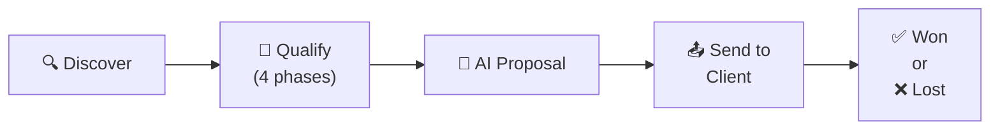
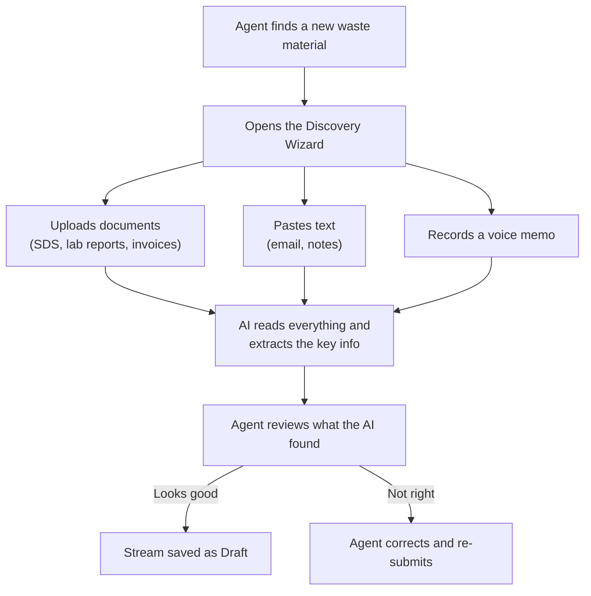
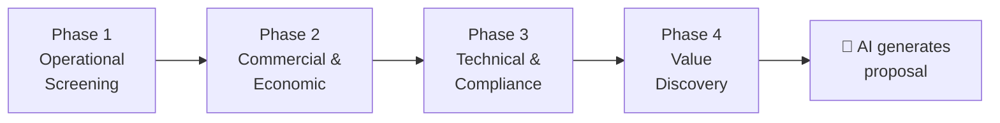
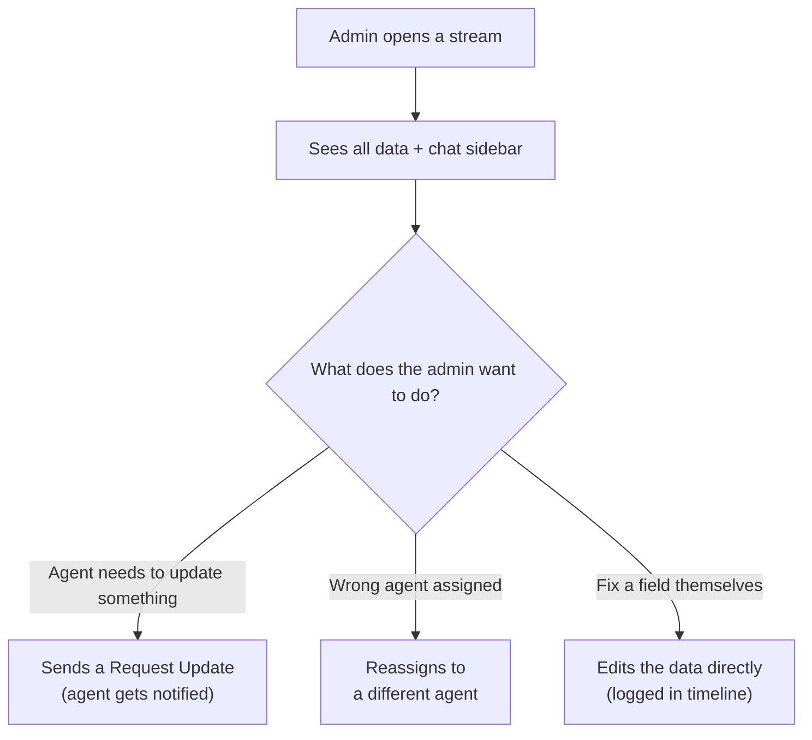
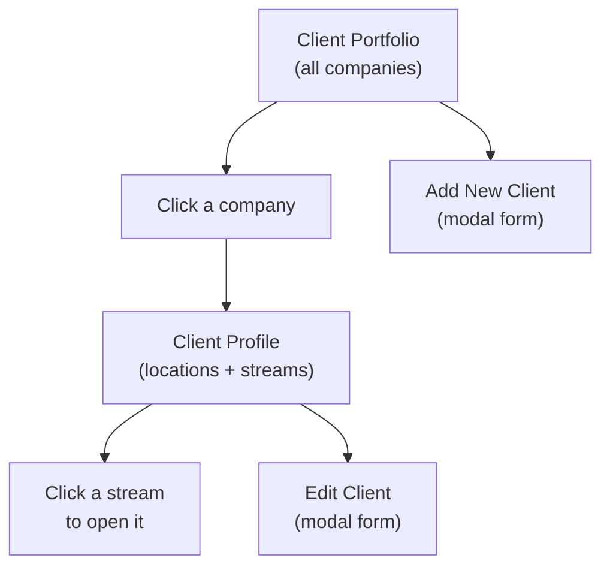

# Second Stream — Product Flow

> **Version:** 3.2  
> **Last Updated:** March 23, 2026  
> **Audience:** Everyone — Product, Design, Engineering, Stakeholders  
> **What this document is:** The complete map of how people use Second Stream, step by step.

---

## How Second Stream Works (The Big Picture)

Second Stream helps waste logistics companies turn industrial waste into business opportunities. There are two types of users:

- **Field Agents** go out to client sites (factories, plants, warehouses), discover waste materials, and build proposals to sell recycling/recovery services.
- **Admins** manage the team of agents, monitor the sales pipeline, and provide support when agents get stuck.

Every deal follows the same path:

```
Discover waste → Collect information (4 steps) → AI creates a proposal → Send to client → Win or lose
```

---

## 1. The Life of a Deal

A waste stream deal moves through these stages:



### Two ways to start a deal

| Method | How it works | Starting status |
|--------|-------------|-----------------|
| **AI Discovery** | Agent uploads files, records audio, or pastes text. The AI reads it and suggests waste streams it found. Agent reviews and confirms. | Starts as **Draft** (needs review) |
| **Manual** | Agent fills in the basic info directly (material name, client, location). | Starts as **Active** (ready to work) |

### Deal stages explained

| Stage | What's happening | Who's involved |
|-------|-----------------|----------------|
| **Draft** | AI found this stream — agent hasn't reviewed it yet | Agent |
| **Active** | Agent is collecting information across the 4 phases | Agent (Admin can monitor) |
| **Needs Attention** | Something is wrong — missing info, or no activity for 14+ days | Agent fixes it, Admin can help |
| **Proposal Ready** | All 4 phases done — AI generated a commercial proposal | Agent sends it to the client |
| **Won** | Client accepted the proposal | Deal closed |
| **Lost** | Client declined | Deal closed |

**Important:** The agent controls the deal from start to finish. The admin can monitor, help, and give feedback, but does NOT need to approve anything for the deal to move forward.

---

## 2. What the Field Agent Does

### Step 1: Discover a waste stream

The agent visits a client site and learns about a waste material. They have two options:

**Option A — Use the AI Discovery Wizard:**



The wizard can process multiple sources at once — an agent could upload a document AND record a voice note in the same session.

**Option B — Create it manually:**

The agent opens a simple form, types in the material name, selects the client and location, and the stream is created directly — no AI involved, no draft stage.

---

### Step 2: Work through the 4 phases

Every waste stream goes through 4 phases of information gathering. Think of it like filling out 4 sections of a detailed questionnaire:



| Phase | Purpose | Think of it as... |
|-------|---------|-------------------|
| **1. Operational Screening** | What is this waste? How much? Where? | "Can we handle this?" |
| **2. Commercial & Economic** | What does disposal cost today? What regulations apply? | "Is there money in this?" |
| **3. Technical & Compliance** | Upload safety documents, chemical details | "Is it legal and safe to handle?" |
| **4. Value Discovery** | What are the client's pain points? ESG goals? | "How do we pitch this?" |

**Rules:**
- Phases must be completed in order — you can't skip to Phase 3 without finishing Phase 2.
- The agent can save their progress at any time and come back later.
- While working on any phase, the agent can quickly send an email, log a call, upload a document, or record a voice note — all from the same screen.

> **Note:** The specific fields (questions) in each phase are not yet finalized. The Stitch designs show example fields to demonstrate the layout, but the actual questions will be defined before development.

---

### Step 3: Manage your pipeline

The agent has three views to manage their work:

| View | What it shows | When to use it |
|------|--------------|----------------|
| **All Streams** | Every active stream with search, filter, and sort | Daily pipeline overview |
| **Drafts** | Streams created by AI that need review — with quick inline editing | Process new AI discoveries quickly |
| **Urgent Follow-ups** | Streams flagged by the system as stale or missing critical info | Unblock stuck deals |

---

### Step 4: Proposals

When all 4 phases are complete, the AI automatically generates a commercial proposal. The agent can then:

1. **Review** the proposal (Material Info, Economic Analysis, AI Strategic Insights)
2. **Upload** a PDF version if they create a custom one
3. **Send** the proposal to the client via email (directly from the app)
4. **Mark the outcome**: Won or Lost

Past proposals are saved in a searchable Historical Archive.

---

## 3. What the Admin Does

The admin oversees the entire organization's sales operation.

### Dashboard

The admin's home screen shows:

- **Team numbers:** How many agents are active, streams per agent, completion rates
- **Pipeline health:** Total active streams, proposals generated, win rate
- **Alerts:** Stale streams, agents who need help, items requiring attention

### Monitor the pipeline

The admin has special views that agents don't see:

| View | What it shows |
|------|--------------|
| **Regional Heat Map** | A geographic map showing where waste streams are concentrated — by tonnage, material type, or agent |
| **Follow-up Control** | Tracks requests the admin sent to agents — how long ago, whether they were addressed |
| **All Streams** | Every stream across all agents in the organization |

### Review a specific stream

When the admin opens a stream, they see everything the agent sees — but with extras:

- **Wide header** with audit information (who created it, when, full status history)
- **Communication sidebar** — a chat thread with the assigned agent, right next to the stream data
- **All 4 phases visible** without gating — the admin can jump to any phase and see/edit any field
- **Actions:** Request an update from the agent, reassign to a different agent, or edit fields directly



### Manage the team

The admin can:

- View each agent's profile with performance metrics (streams completed, win rate, speed)
- See what streams each agent is working on
- Chat directly with any agent via a floating chat panel
- Add new team members or edit existing profiles
- Reassign streams between agents for workload balancing

---

## 4. Client Management (Both Roles)

Both agents and admins can manage the client portfolio:



- **Client Portfolio** shows all client companies as cards — with their industry, number of locations, number of streams, and total pipeline value
- **Client Profile** shows a specific company with all its physical locations and the waste streams at each location

---

## 5. Quick Actions (Available While Working on a Stream)

While inside a stream detail, the agent (or admin) can trigger these actions without leaving the page:

| Action | What it does |
|--------|-------------|
| **Send Email** | Opens an email composer with the client's contact pre-filled |
| **Log a Call** | Records a phone call with notes and outcome |
| **Log Activity** | Records a meeting, site visit, or other interaction |
| **Upload Document** | Adds a file (SDS, lab report, etc.) to the stream |
| **Quick Paste** | Pastes unstructured text — AI extracts relevant data and fills in fields |
| **Voice Memo** | Records audio — AI transcribes it and extracts relevant data |

---

## 6. Complete Screen Map

Every screen in the application and how they connect:

### Field Agent screens

```
Agent Dashboard
  ├── Discovery Wizard → AI Confirmation → Drafts
  ├── Waste Stream Management
  │     ├── All Streams → Stream Detail (Phases 1-4)
  │     ├── Drafts (inline edit) → Stream Detail
  │     └── Urgent Follow-ups → Stream Detail
  ├── Client Portfolio → Client Profile → Stream Detail
  └── Proposals Pipeline → Proposal Detail → Historical Archive
```

### Admin screens

```
Admin Dashboard
  ├── Regional Heat Map
  ├── Follow-up Control → Admin Stream Detail
  ├── All Streams → Admin Stream Detail (with chat sidebar)
  └── Team Management → Agent Profile (with floating chat)
```

### Shared modals (pop up on top of any screen)

```
Discovery Wizard          Add New Client         Send Email
AI Confirmation           Edit Client            Call Client
Manual Stream Creation    Assign Agent           Log Activity
Complete Discovery        Request Update         Upload Document
                                                 Quick Paste
                                                 Voice Memo
```

---

## 7. What Happens When Things Go Wrong

| Situation | What the system does |
|-----------|---------------------|
| Agent tries to skip a phase | Blocked — shows message "Complete the previous phase first" |
| A stream has no activity for 14+ days | System automatically flags it as "Needs Attention" and moves it to the Urgent Follow-ups view |
| AI can't find any waste streams in uploaded documents | Shows "No waste streams detected" with option to try again |
| AI proposal generation fails | Stream stays active — error is logged and agent can retry |
| Admin edits a field in an agent's stream | The change is recorded in the activity timeline and the agent is notified |
| Admin sends a "Request Update" | A message appears in the stream's chat sidebar and the agent gets a notification |
| Agent uploads an expired document (SDS/COA older than 6 months) | Warning is shown — agent can save but can't complete the phase until the document is updated |

---

## 8. What's Not Yet Decided

Some parts of the product are not fully defined yet. See PRD.md Section 10 for the complete list. The main ones:

- **Phase fields:** What specific questions are asked in each of the 4 phases
- **Notifications:** How users find out about events (in-app, email, push?)
- **Reports/Analytics:** What metrics are shown, to whom
- **Mobile:** Whether and how the app works on phones
- **Onboarding:** What happens when a user logs in for the first time
