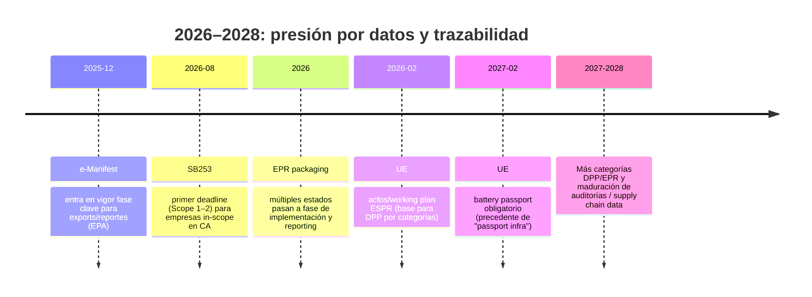
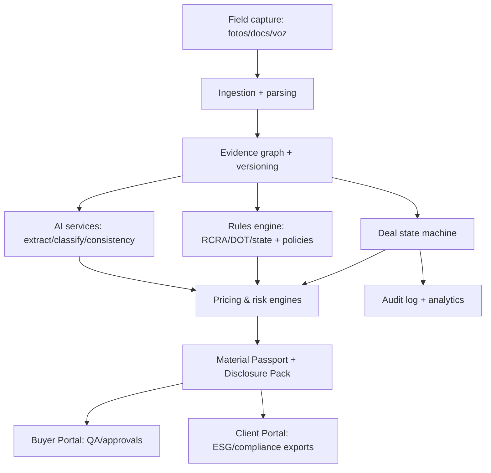

# AI‑Proof Product Strategy para Waste Deal OS

## Resumen ejecutivo

La tesis central (Marzo 2026) es que **la capa “AI feature” se está comoditizando rápido**, mientras que **la capa “sistema de acción + data verificable + integración regulatoria” se está volviendo más valiosa**. Inversores y compradores B2B están filtrando “thin wrappers” y favoreciendo plataformas verticales embebidas en workflows críticos, con datos propietarios y capacidad de ejecutar acciones dentro de sistemas reales. citeturn9search3turn1search0turn9news39

Para un broker industrial con 15 agentes y ~20 deals/mes, el producto “AI‑proof” no es “mejor extracción” (eso lo tendrán ChatGPT/Claude/Gemini), sino **un “Waste Deal OS” que produzca ventajas acumulativas**:

- **Moat por datos operativos**: dataset propietario de outcomes “flujo → evidencia → pruebas → aceptación/rechazo → reclamo → margen”. Este dataset alimenta pricing y riesgo (lo que más cuesta copiar). citeturn1search0turn9news39  
- **Moat por estandarización**: “Material Passport” como **artefacto de compra y auditoría** (QA/procurement + ESG). La estandarización de specs existe en reciclaje/scrap (ReMA/ISRI), y la UE está convirtiendo “pasaportes” en infraestructura de información (ESPR/DPP y Battery Passport). citeturn4search0turn4search9turn7search22turn7search24turn4search22  
- **Moat regulatorio**: integración y control de cambios para e‑Manifest (costos/fees, adopción estatal, y el “paper sunset” como dirección de viaje) + empaques EPR multi‑estado + disclosure (SB253). citeturn0search33turn4search2turn4search22turn0search19turn12search12turn12search0  
- **Moat de ejecución**: “system of action”: tareas y decisiones se terminan dentro del sistema con evidencias, aprobaciones y trazabilidad (no solo reportes).

A nivel de roadmap, la estrategia AI‑proof se resume así:

1) **Convertir “capturar → extraer → reportear” en “capturar → validar → decidir → transaccionar → auditar”** (estado de deal, completeness, QA, buyer approvals, compliance gate). citeturn9search3turn1search0  
2) **Enfocar AI en “riesgo + decisión” (no en “contenido”)**: probabilidad de rechazo, qué prueba de laboratorio pedir, qué descuento aplicar, qué cláusula usar.  
3) **Prepararse para agentes**: la madurez de agentic AI aumentó (estándares como MCP en la entity["organization","Linux Foundation","open source foundation"] y predicciones de adopción), pero el riesgo/fracaso también; el diseño debe ser evaluable y con guardrails desde el día 1. citeturn1search3turn1search7turn1search2turn1search20  

---

## Defensibilidad de AI

**Hallazgos clave (qué se vuelve commodity vs qué sobrevive)**

- El consenso 2025–2026 en venture y producto es que **“AI SaaS = wrapper” está perdiendo defensibilidad**: la ventaja no puede vivir en “UI + prompts + extracción genérica”, porque los modelos base y suites lo bundlean rápidamente. La cobertura de entity["organization","TechCrunch","tech media outlet"] recoge explícitamente que inversores priorizan **AI‑native infrastructure, vertical SaaS con datos propietarios y systems of action** (y evitan categorías “thin” que se vuelven features). citeturn9search3  
- entity["company","Andreessen Horowitz","venture capital firm"] argumenta que “AI no mata software”, sino que lo reconfigura: el valor se mueve hacia software que **ejecuta la acción en el workflow**, con integración y datos. citeturn1search0turn1search29  
- La disrupción por modelos base no es hipotética: entity["organization","Reuters","news agency"] documenta casos donde la IA (y su distribución gratuita/bundled) destruye modelos de negocio basados en “contenido/ayuda” (p. ej., entity["company","Chegg","edtech company"] con caídas de suscriptores y reestructuraciones atribuidas a herramientas tipo ChatGPT y cambios de tráfico). citeturn2news40turn2news41  
- Los “AI moats” observables en B2B (industrial/regulado) se parecen a esto:  
  - **Integración profunda** en sistemas core (EHR, contractors ops, claims workflows, etc.).  
  - **Datos propietarios de operación** (telemetría, imágenes con outcomes, feedback de expertos).  
  - **Alto costo del error** (riesgo regulatorio/operativo), lo que eleva barreras y crea switching costs.  
  Casos ilustrativos con métricas/funding recientes:  
  - entity["company","Abridge","clinical documentation ai"]: levantó $250M (Series D) y reportó superar 100 deployments en grandes health systems (señal PMF en workflow crítico). citeturn2search18turn2search26  
  - entity["company","Harvey","legal ai startup"]: rondas con valuaciones altas y crecimiento de run‑rate reportado; además integra múltiples modelos (OpenAI/Anthropic/Google) como “supply chain” para el workflow legal (señal de que el moat no es “un modelo”). citeturn8search7turn8search3  
  - entity["company","Augury","industrial ai predictive maintenance"]: financiamiento $75M (2025) en “industrial AI” donde la data (sensores/horas‑máquina) y el costo del error construyen defensibilidad. citeturn8search1turn8search21  
  - entity["company","BuildOps","contractor management software"]: $127M a valuación $1B (2025) en contractors, un vertical con multi‑actor workflow y datos operativos. citeturn8search30turn8search10  
  - entity["company","Tractable","insurance ai claims"]: inversión SoftBank $65M (2023) para claims visuales; muestra que CV + outcomes + workflow de decisión puede sostener moat cuando hay costos de error y data propietaria. citeturn8search0turn8search4  
- “AI agents” sí cambian el juego frente a hace 12 meses, pero también elevan el estándar:  
  - entity["company","Anthropic","ai company"] publicó cómo llevó a producción un **sistema multi‑agente de investigación**, con lecciones sobre tool design, paralelización y arquitectura (señal de madurez real). citeturn0search21  
  - En dic 2025, Anthropic donó **Model Context Protocol (MCP)** a la Agentic AI Foundation, cofundada con entity["company","OpenAI","ai company"] y entity["company","Block","payments company"] bajo Linux Foundation: evidencia de que **interoperabilidad y estándares para agentes** se están institucionalizando. citeturn1search3turn1search7turn1search11  
  - entity["company","Gartner","research advisory firm"] predice que >40% de proyectos agentic se cancelarán para 2027 (costos, valor poco claro y risk controls); y Reuters reporta también el pronóstico de que agentes participarán en una fracción material de decisiones/soft enterprise hacia 2028. Esto implica: **agentes = ventaja si están gobernados/evaluados; riesgo si son “agent washing”**. citeturn1search2turn1search20  

**Framework práctico: “¿Se comoditiza en 12–18 meses?” (7 pruebas)**  
Usa este checklist por feature. Si falla 4+ pruebas, trátalo como commodity y úsalas solo como “entrada” (wedge), no como moat.

1) **¿La capacidad existe como feature genérica en suites/modelos base?** (document upload, vision, extracción). citeturn9search3turn1search0  
2) **¿Requiere integración con sistemas/registros reales (RCRA/e‑Manifest, ERP, auditoría)?** Si sí, commoditiza más lento. citeturn0search33turn4search22turn9news39  
3) **¿Tiene “ground truth” continuo y outcomes cuantificables?** (rechazos, margen, reclamos). Eso crea data flywheel.  
4) **¿El costo del error es alto y exige trazabilidad/explicabilidad?** (regulación, seguridad, liability). citeturn1search2turn1search20  
5) **¿Genera switching costs por estado/colaboración multi‑actor?** (buyer portal, approvals, chain‑of‑custody).  
6) **¿La ventaja depende de datos propietarios (no raspables) y normalizados?**  
7) **¿Tu UX está acoplada a decisiones/acción (“system of action”), no solo a contenido?** citeturn9search3turn1search0  

**Análisis específico de features de Waste Deal OS (riesgo de comoditización vs defensibilidad)**

| Feature | Riesgo de comoditización 12–18m | Qué se commoditiza | Qué puede ser moat (si lo construyes bien) |
|---|---|---|---|
| Extracción de datos (SDS, lab reports, waste profiles) | Alto | OCR/parseo genérico + extracción de campos | “Schema + validity rules + evidence graph + audit trail” y aprendizaje de correcciones por campo/lab; integración con compliance gates |
| Clasificación por imagen (fotos de waste) | Alto | Vision “describe/classify” genérico | Calibración por material/contaminantes + outcomes (aceptación/rechazo) + linking a specs y pruebas requeridas |
| Transcripción de entrevistas/voz | Muy alto | Transcribe/summarize commodity | Vincular a checklist de completeness, contradicciones vs docs, y generación de preguntas faltantes por buyer/regulador |
| “Compliance suggestions” (RCRA/DOT/estado) | Medio | “Asesoría” general, no confiable | Motor híbrido: reglas/versionado + evidencia; trazabilidad de por qué; actualización continua de cambios (e‑Manifest, PFAS flags, state adoption) citeturn0search33turn4search22turn7search33turn7search2 |
| Tracking de info faltante (“deal completeness”) | Medio | Task tracker genérico | Si se conecta a *gates* (no puedes vender/comprar sin X evidencia) y a buyer portal; se vuelve switching cost |
| Pricing intelligence (histórico + spreads) | Bajo–medio | Benchmarks públicos superficiales | Dataset propietario + price decomposition (flete, yield, riesgo, rechazo) + recomendaciones de términos; esto es “alpha” del broker |
| Lab decision engine (qué pruebas pedir y cuándo) | Bajo | Reglas genéricas | Modelo basado en outcomes + requisitos por buyer + costos/beneficio; se vuelve “playbook codificado” |

**Implicaciones para su producto (qué hacer diferente para ser AI‑proof)**

- Tratar “AI extracción” como **commodity input** y poner el moat en:  
  1) **modelo de datos canónico del deal**,  
  2) **gates auditable** (compliance + buyer QA),  
  3) **pricing/risk engine con outcomes**,  
  4) **multi‑actor workflow** (broker ↔ buyer ↔ procesador ↔ carrier). citeturn9search3turn1search0turn9news39  
- Diseñar desde ya para “agents”, pero con postura conservadora: **agente ejecuta tareas determinísticas con aprobación humana** (submits forms, prepara dossiers, pide labs), no “autonomía abierta”. El mercado ya muestra que muchos proyectos agentic mueren por falta de controles y ROI claro. citeturn1search2turn1search20turn0search21  

**Riesgos a vigilar (lo que podría volver obsoleto su enfoque)**

- Bundling acelerado de capacidades genéricas por suites/modelos → presión de pricing si su propuesta se interpreta como “extractor + report generator”. citeturn9search3turn1search0turn9news39  
- “Agent washing”: prometer autonomía y fallar en edge cases; Gartner advierte cancelaciones masivas por costos/valor/riesgo. citeturn1search2turn1search20  
- Riesgo de seguridad/integración de tool‑use (sobre todo si conectan a sistemas regulatorios): el auge de MCP/estándares ayuda, pero también amplía superficie de ataque y responsabilidad. citeturn1search3turn1search7  

**Recomendaciones concretas (próximos pasos accionables)**

- Definir un **“Deal Canonical Schema”** (el objeto “waste stream lot”): campos, evidencias, versiones, estado, “confidence”, owner, y reglas de validación.  
- Construir un **“Outcome Ledger”** mínimo desde ya: por lote registrar (a) precio, (b) buyer, (c) aceptación/rechazo, (d) razones, (e) reclamos, (f) margen final. Esto alimenta pricing y risk.  
- Convertir “Material Passport” en **contrato de datos**: formato exportable + buyer portal + checklist por buyer. Alinear conceptos con estándares existentes (specs ReMA/ISRI) y con la dirección UE “passport”. citeturn4search0turn4search9turn7search22turn7search24  
- Implementar “agentic” por capas: (1) extracción, (2) verificación y señalamiento de inconsistencias, (3) generación de tareas/requests, (4) ejecución con “human approval + audit log”. citeturn0search21turn1search2  

**Fuentes (URLs)**  
```text
https://techcrunch.com/2026/03/01/investors-spill-what-they-arent-looking-for-anymore-in-ai-saas-companies/
https://a16z.com/good-news-ai-will-eat-application-software/
https://www.reuters.com/commentary/breakingviews/software-rout-exacerbates-buyout-exit-crunch-2026-02-25/
https://www.reuters.com/business/over-40-agentic-ai-projects-will-be-scrapped-by-2027-gartner-says-2025-06-25/
https://www.gartner.com/en/newsroom/press-releases/2025-06-25-gartner-predicts-over-40-percent-of-agentic-ai-projects-will-be-canceled-by-end-of-2027
https://www.anthropic.com/engineering/multi-agent-research-system
https://www.anthropic.com/news/donating-the-model-context-protocol-and-establishing-of-the-agentic-ai-foundation
https://www.linuxfoundation.org/press/linux-foundation-announces-the-formation-of-the-agentic-ai-foundation
https://investor.chegg.com/Press-Releases/
https://www.reuters.com/world/americas/chegg-lay-off-22-workforce-ai-tools-shake-up-edtech-industry-2025-05-12/
https://www.reuters.com/sustainability/boards-policy-regulation/hit-by-ai-edtech-firm-chegg-slashes-jobs-names-new-ceo-major-overhaul-2025-10-27/
```

---

## Transformación digital en la industria de waste y brokerage

**Hallazgos clave (hacia dónde va la industria 2025–2026)**

- La digitalización regulatoria en hazardous waste ya es realidad operativa: la regla “Integrating e‑Manifest with Exports…” establece requisitos con hitos efectivos (p. ej., capacidades para e‑Manifest en exports/manifest reports). La publicación en Federal Register (jul 2024) y la guía EPA consolidan que el sistema empuja a menos papel y más centralización. citeturn0search33turn0search2turn4search22  
- El precio de “seguir en papel” sube: EPA publica user fees FY 2026–2027 y explica que las tarifas se calculan por tipo de manifest y costos de procesamiento; además, la comunicación oficial muestra que el programa sigue ajustando prioridades y fees (incentivo económico a digital). citeturn4search2turn4search22  
- Hay presión regulatoria/substancias emergentes que aumenta complejidad documental, p. ej., el empuje de PFAS en el ecosistema RCRA y el mapa de adopción estatal de mejoras de generadores (estado por estado). Esto favorece software que versiona reglas y evidencia. citeturn7search2turn7search33  
- En disclosure/ESG: entity["organization","California Air Resources Board (CARB)","california air regulator"] fijó **Aug 10, 2026** como deadline inicial de SB253 (Scope 1–2 para primer año) y definió aspectos de fees/implementación. Esto convierte a brokers en proveedores de datos (destino de residuos, evidencias, etc.) para clientes in‑scope. citeturn0search19  
- En empaques, EPR multi‑estado está pasando de “concepto” a “compliance”: análisis legal reciente resume cobertura de estados (CA/CO/ME/MD/MN/OR) y qué cubre cada uno; además, el propio entity["organization","Product Stewardship Institute","nonprofit product stewardship"] mantiene un mapa de leyes EPR. citeturn12search12turn12search0  
- En California, entity["organization","CalRecycle","state recycling agency california"] confirma que SB54 establece un programa EPR para packaging/food service ware y está en rulemaking, señalando un horizonte de reporting y requisitos de datos para materiales/reciclabilidad (impacto indirecto en flujos y evidencia). citeturn12search1turn12search17  
- En la UE, la estandarización de “pasaportes” avanza: la entity["organization","Comisión Europea","eu executive body"] publica timeline de implementación ESPR y working plan 2025–2030; esto indica que “pasaportes digitales” son infraestructura obligatoria por categorías en los próximos años. citeturn4search0turn4search9  
- Para baterías, la entity["organization","European Chemicals Agency (ECHA)","eu chemicals agency"] resume que existe batería passport (Arts. 77–78) y que ciertas baterías deben tener “battery passport” con info del Annex XIII; un documento de guidance europeo indica obligatoriedad desde feb 2027 (para EV/LMT/industrial >2kWh). Esto es un precedente directo para “material passports” en cadenas industriales. citeturn7search22turn7search24  
- AI en waste/recycling hoy está concentrada en “donde duele”: pureza, throughput y mano de obra en sorting. Ejemplos 2024–2025:  
  - entity["company","AMP Robotics","ai waste sortation company"] levantó $91M (Series D) para sortation a escala. citeturn6search2turn6search10  
  - entity["company","Glacier","ai recycling robotics startup"] levantó $16M (Series A, 2025) y reportó financiamiento previo (2024) para desplegar robots en MRFs; medios sectoriales describen despliegues y métricas de picking. citeturn6search12turn6search20turn6news40  
  - entity["company","SuperCircle","textile waste management platform"] reportó $24M Series A (dic 2025) para “waste management OS” en textiles con data granular por prenda (digital twin/atributos). citeturn6search3turn6search11turn6search7  
- Evidencia de que el mercado sí paga por software en waste (aunque no siempre “broker‑specific”):  
  - entity["company","Rubicon","waste and recycling marketplace"] se describe en filings como marketplace digital + soluciones cloud; en un filing S‑3 reporta **>8,000 waste generator customers** y **>8,000 hauling/recycling partners** (señal de adopción y willingness‑to‑pay por plataforma + data). citeturn11search27turn11search1  
  - entity["company","Encamp","environmental compliance software"] reporta financiamiento (Series C $30M) y crecimiento de ARR (autorreporte) en compliance ambiental, señalando que compliance workflows se compran como SaaS cuando son dolorosos. citeturn4search27turn4search16  

**Implicaciones para su producto (cómo alinear Waste Deal OS con la dirección de la industria)**

- e‑Manifest y costos/fees implican que **su “Deal Canonical Schema” debe mapearse a e‑Manifest/RCRAInfo**: si su plataforma reduce fricción y evita errores, puede justificar ROI directo (tiempo y fees). citeturn4search2turn4search22turn0search33  
- SB253 + EPR empujan a “data exhaust” verificable: su “Material Passport” debe poder convertirse en un **“Disclosure Pack”** para clientes (destino, evidencias, mass balance/chain‑of‑custody cuando aplique). citeturn0search19turn12search12turn12search0  
- La UE (ESPR/DPP y battery passport) muestra que el “passport” se está volviendo infraestructura. Aunque ustedes operen en EE.UU., los compradores globales y fabricantes con footprint UE tenderán a exigir **estructuras de datos compatibles** (IDs, evidencia versionada, acceso granular). citeturn4search0turn4search9turn7search22turn7search24  
- La concentración de inversión AI en “sorting/processing” sugiere que brokers necesitarán conectar upstream y downstream: su OS puede ser el **tejido conectivo** entre campo → procesamiento → buyer QA (y no competir con robots). citeturn6search2turn6search12  

**Riesgos a vigilar**

- Fragmentación: EPR y adopción de reglas RCRA varían por estado; un “motor de reglas” sin versionado y sin mapeo a jurisdicción se convierte en consultoría manual. citeturn7search33turn12search12  
- “AI hype” en waste: mucha AI se concentra en sorting y municipal; el riesgo es confundir señales de inversión (robots) con necesidades del broker (evidencia + decisión + compliance). citeturn6search2turn6search12  
- Cambios legales y litigios (p. ej., EPR en algunos estados) pueden cambiar timing; el producto debe manejar “effective dates” y estados de implementación. citeturn12search18turn12search10  

**Recomendaciones concretas**

- Implementar un **“Regulatory Timeline + Rules Registry”** dentro del producto: e‑Manifest milestones, fees, adopción estatal, y cambios EPR relevantes para clientes. citeturn4search2turn4search22turn12search0turn12search10  
- Lanzar “Disclosure Pack v1” para 3 drivers: (1) SB253 (cliente CA), (2) EPR packaging (cliente producer/retail), (3) buyer QA. citeturn0search19turn12search12  
- Diseñar “Material Passport” con forward‑compatibility: IDs, accesos por rol, y anexos de evidencia (aprender del enfoque UE a pasaportes). citeturn4search0turn7search24  

**Mini‑timeline regulatorio 2026–2028 (lo digital que impacta al broker)**  
*(referencia: EPA e‑Manifest + CARB + EPR + UE DPP)* citeturn0search33turn4search22turn0search19turn12search12turn4search0



**Fuentes (URLs)**  
```text
https://www.epa.gov/e-manifest
https://www.federalregister.gov/documents/2024/07/26/2024-14694/integrating-e-manifest-with-hazardous-waste-exports-and-other-manifest-related-reports-pcb-manifest
https://www.epa.gov/e-manifest/e-manifest-user-fees-and-payment-information
https://ww2.arb.ca.gov/news/carb-approves-climate-transparency-regulation-entities-doing-business-california
https://productstewardship.us/epr-laws-map/
https://www.mayerbrown.com/en/insights/publications/2026/02/epr-packaging-laws-moving-from-concept-to-compliance
https://calrecycle.ca.gov/laws/rulemaking/sb54regulations/
https://calrecycle.ca.gov/packaging/packaging-epr/
https://www.oregon.gov/deq/recycling/pages/modernizing-oregons-recycling-system.aspx
https://commission.europa.eu/energy-climate-change-environment/standards-tools-and-labels/products-labelling-rules-and-requirements/ecodesign-sustainable-products-regulation_en
https://green-forum.ec.europa.eu/implementing-ecodesign-sustainable-products-regulation_en
https://echa.europa.eu/legislation-profile/-/legislationprofile/EU-BATTERIES_REGULATION
https://thebatterypass.eu/wp-content/uploads/q-a_content-guidance.pdf
https://ampsortation.com/articles/amp-raises-91m-seriesd
https://techcrunch.com/2024/12/05/amp-robotics-raises-91m-to-build-more-robot-filled-waste-sorting-facilities/
https://www.wastedive.com/news/glacier-series-a-funding-recology-seattle-mrf-robotics-ai/746774/
https://techcrunch.com/2025/04/28/amazon-backed-glacier-gets-16m-to-expand-its-robot-recycling-fleet/
https://www.prnewswire.com/news-releases/supercircle-raises-24m-series-a-to-scale-retails-waste-management-operating-system-302637202.html
https://www.esgtoday.com/supercircle-raises-24-million-to-help-retail-brands-make-money-recycling-end-of-life-textiles/
https://www.sec.gov/Archives/edgar/data/1862068/000182912623005921/rubicontech_s3.htm
https://encamp.com/blog/encamp-valuation-hits-150m-after-30m-raise/
```

---

## Arquitectura de plataforma AI vertical

**Hallazgos clave (cómo operan las plataformas verticales AI con PMF)**

- Los vertical “AI OS” que logran PMF tienden a ser **híbridos** (AI + reglas + estado + auditoría), no “un solo modelo”:
  - Las predicciones y análisis de Gartner/Reuters sobre cancelaciones de proyectos agentic por costos/valor/controles indican que producción requiere **evaluación, gobernanza y narrow workflows**. citeturn1search2turn1search20  
  - Anthropic describe una arquitectura multi‑agente en producción que enfatiza tool design, control de flujo y lecciones operativas (no “demo”). citeturn0search21  
- “Multi‑model” se volvió patrón real en software vertical enterprise: Reuters reporta que Harvey combinó modelos de OpenAI y se expandió a modelos de Anthropic y Google, lo que sugiere que el moat está en **workflow + datos + integraciones**, no en “tener el mejor modelo”. citeturn8search3  
- Los casos de estudio con PMF muestran una constante: **se integran en el sistema donde ocurre el trabajo** (EHR, contractor ops, claims workflows, etc.) y convierten output en un artefacto válido (nota clínica, estimate de reparación, etc.). citeturn2search18turn8search30turn8search4turn8search1  
- La estandarización y la “data layer” son parte del producto: la UE está imponiendo pasaportes como infraestructura por regulación (ESPR y battery passport), lo que valida el enfoque “passport + evidencia + acceso”. citeturn4search0turn7search24  
- La industria está construyendo estándares para “agent tool‑use”: MCP en Linux Foundation y proyectos fundacionales para interoperabilidad. Esto hará más fácil conectar agentes a sistemas (y por ende, más competitivo el paisaje). citeturn1search3turn1search7turn1search32  

**Casos de estudio (7) y qué copiar para Waste Deal OS**  
*(métricas/funding como señales; lo valioso es el patrón de arquitectura y workflow)*

| Caso | Señal de PMF / tracción | “Moat pattern” que aplica a ustedes | Fuente |
|---|---|---|---|
| Abridge (clinical) | $250M Series D + “100+ deployments” | Artefacto crítico (nota clínica) + integración + QA | citeturn2search18turn2search26 |
| Harvey (legal) | Crecimiento de run‑rate reportado + multi‑model | Orquestación + integraciones enterprise + control de datos | citeturn8search3turn8search7 |
| Augury (industrial) | $75M ronda 2025 | Data flywheel con telemetría + costo de error alto | citeturn8search1turn8search21 |
| BuildOps (contractors) | $127M a $1B valuación | Multi‑actor workflow OS + switching costs por operación | citeturn8search30turn8search10 |
| Tractable (claims) | $65M SoftBank | CV + outcomes + auditoría/estimaciones reales | citeturn8search0turn8search4 |
| Encamp (EHS/compliance) | Series C $30M + ARR growth (autorreporte) | Compliance OS con reporting + evidencia | citeturn4search27turn4search16 |
| Treefera (first‑mile supply chain) | Serie B $30M | “Trusted dataset” + APIs + ESG compliance en cadena | citeturn5news48 |

**Implicaciones para su producto (arquitectura “AI‑proof” recomendada en 2026)**

La arquitectura defensible para Waste Deal OS debería parecerse a un **sistema de estado + evidencia + decisiones**, con AI como motor de estructuración y copiloto de decisión, no como “generador”. En concreto:

- **Capa 1 — System of Record del deal (estado)**: un workflow engine con estados (draft → incomplete → compliant‑ready → buyer‑ready → contracted → shipped → settled), con permisos por rol.  
- **Capa 2 — Evidence graph (auditoría)**: cada campo estructurado apunta a evidencia (foto, página de SDS, lab result, nota de voz) con versionado y “confidence”.  
- **Capa 3 — Rules engine (determinístico)**: reglas RCRA/DOT/estado y reglas internas (p. ej., “no cotizar sin X”), con fechas efectivas. Se alimenta de fuentes como EPA/CARB y adopción estatal. citeturn4search22turn0search19turn7search33  
- **Capa 4 — AI services (especializados)**: extracción, clasificación, deduplicación, inconsistencia detection, y generación de tareas faltantes.  
- **Capa 5 — Decision engines**:  
  - Pricing & margin model (histórico + decomposition).  
  - Risk-of-rejection score (por buyer/material).  
  - Lab decision engine (cost/benefit).  
- **Capa 6 — Multi‑actor portals**: buyer portal para QA y approvals; data packs para disclosure/compliance.  
- **Capa 7 — Eval/observabilidad**: pruebas por workflow (no solo “accuracy”), con métricas de negocio (tiempo a cierre, rechazos, retrabajo). Gartner sugiere que sin risk controls y valor claro, se cancelan proyectos; por eso la evaluación debe ser first‑class. citeturn1search2turn1search20  

**Diagrama (referencia de arquitectura)**



**Riesgos a vigilar**

- Multi‑agente “demasiado pronto”: aunque hay madurez y estándares, Gartner/Reuters muestran alto riesgo de cancelación si no hay ROI y controles; agentes deben introducirse gradualmente. citeturn1search2turn1search20turn1search3  
- “Learning from corrections” sin gobernanza: si las correcciones reentrenan sin control, pueden degradar calidad o contaminar datos entre clientes (riesgo contractual).  
- Integraciones regulatorias: conectar a e‑Manifest/RCRAInfo implica responsabilidad de datos; su sistema debe registrar quién cambió qué y por qué.

**Recomendaciones concretas**

- Diseñar “correcciones” como **first‑class data**: cada corrección crea un ejemplo etiquetado (campo → evidencia → valor correcto → razón), y se reutiliza para: mejores extractores, mejores preguntas faltantes y mejores scores de riesgo.  
- Empezar con **single‑agent supervisor + sub‑tareas determinísticas** (extract → validate → propose tasks), y posteriormente “agents que ejecutan” (subir reportes, preparar paquetes) solo cuando haya guardrails y approvals. citeturn0search21turn1search3  
- Adoptar MCP/estándares (cuando aplique) para conectar herramientas internas/externas sin rehacer integraciones; esto reduce costo de evolución en un mundo multi‑agente. citeturn1search3turn1search7turn1search32  

**Fuentes (URLs)**  
```text
https://www.anthropic.com/engineering/multi-agent-research-system
https://www.anthropic.com/news/donating-the-model-context-protocol-and-establishing-of-the-agentic-ai-foundation
https://www.linuxfoundation.org/press/linux-foundation-announces-the-formation-of-the-agentic-ai-foundation
https://www.gartner.com/en/newsroom/press-releases/2025-06-25-gartner-predicts-over-40-percent-of-agentic-ai-projects-will-be-canceled-by-end-of-2027
https://www.reuters.com/business/over-40-agentic-ai-projects-will-be-scrapped-by-2027-gartner-says-2025-06-25/
https://www.reuters.com/technology/legal-startup-harvey-ai-talks-raise-funding-5-billion-valuation-2025-05-14/
https://www.reuters.com/legal/transactional/legal-ai-firm-harvey-raises-100-mln-new-funding-round-2024-07-23/
https://www.reuters.com/business/healthcare-pharmaceuticals/healthcare-startup-abridge-raises-250-million-enhance-ai-capabilities-2025-02-17/
https://www.reuters.com/technology/buildops-valued-1-billion-funding-round-plans-scale-operations-amid-strong-2025-03-21/
https://www.reuters.com/technology/softbank-group-invests-65-million-uk-ai-firm-nikkei-2023-07-18/
https://www.augury.com/media-center/press/augury-announces-75-million-of-funding-and-maintains-1b-valuation-as-it-accelerates-leadership-in-industrial-ai-solutions/
https://buildops.com/resources/series-c/
https://www.businessinsider.com/pitch-deck-treefera-funding-series-b-climate-supply-chain-ai-2025-6
```

---

## Network effects y dinámicas de marketplace en B2B industrial

**Hallazgos clave (qué funciona al pasar de herramienta → plataforma → red)**

- Los marketplaces B2B que logran network effects suelen resolver el “cold start” con un **wedge de alto valor** previo a la liquidez:  
  - entity["company","Faire","b2b wholesale marketplace"] redujo riesgo de inventario para retailers con términos favorables (“friendly trade terms”) y luego escaló matching; un caso académico del Digital Data Design Institute (Harvard) describe explícitamente que su propuesta mitiga riesgo de introducir productos nuevos. citeturn10search17  
  - entity["company","Flexport","digital freight forwarder"] se presenta como freight forwarder “powered by software”; McKinsey reporta que llegó a ser el sexto freight forwarder transpacific en menos de una década, mostrando que **operación + software** puede crear plataforma (y luego red/partners). citeturn10search24  
- En waste/recycling, sí existen intentos de marketplace:  
  - Rubicon se describe formalmente como “digital marketplace for waste and recycling” en filings 10‑K/10‑Q, con modelo sin infraestructura propia (coordina partners). citeturn11search1turn11search4  
  - entity["company","Rheaply","enterprise reuse marketplace"] combina asset management + marketplace; la entity["organization","Ellen MacArthur Foundation","circular economy nonprofit"] lo presenta como ejemplo de circularidad para FF&E/building materials, y Axios reportó usuarios y adopción enterprise (además de financiamiento). citeturn10search19turn10news41  
  - entity["company","Excess Materials Exchange","materials marketplace"] se posiciona como marketplace facilitado con mezcla de expertise humano + AI para matchmaking. citeturn11search2turn11search36  
  - entity["company","ScrapMonster","scrap marketplace and pricing"] y entity["company","RecycleNet","secondary materials marketplace"] operan como hubs de pricing/spot market, lo que confirma demanda de “descubrimiento” y benchmarks en mercados opacos. citeturn11search0turn11search9  
- El reto en waste brokerage industrial es que el “marketplace puro” choca con **calidad, logística, responsabilidad regulatoria y confianza**: Rubicon enfatiza la necesidad de coordinación de partners y experiencia digital; y la evidencia histórica en el sector muestra que intermediación suele persistir cuando la calidad/riesgo es alta. citeturn11search1turn11search27  
- En mercados opacos, crear transparencia sin alienar incumbentes requiere tácticas de “benchmarking agregado” (no exponer deals individuales). Plataformas de pricing como ScrapMonster existen, pero en brokerage industrial el dato más sensible es “precio + especificación + terms” por buyer. citeturn11search0turn11search30  

**Implicaciones para su producto (estrategia broker‑céntrica que empodera, no desintermedia)**

- El movimiento “tool → platform” más seguro para Waste Deal OS es **multi‑actor sin marketplace abierto**:
  1) **Fase broker (system of action)**: ganar con velocidad, menos errores y mejor margen.  
  2) **Fase buyer portal**: el comprador usa su sistema para QA/approvals; esto crea switching costs sin necesitar liquidez de marketplace.  
  3) **Fase generador/supplier data packs**: su cliente (fábrica) recibe disclosure packs y compliance packs.  
  4) **Fase network**: solo cuando exista estandarización (Material Passport) y suficientes transacciones para benchmarks, considerar matching entre brokers/buyers o purchasing cooperatives.  
- Aprender de Faire/Flexport: el “wedge” no es “matching”, sino **reducir riesgo** (inventory risk en Faire; incertidumbre logística en Flexport). En waste brokerage, ese riesgo es **rechazo/regulatorio/calidad**. citeturn10search17turn10search24turn11search1  

**Riesgos a vigilar**

- **Miedo a desintermediación**: si el producto parece “marketplace que revela precios”, brokers pueden resistirse (la opacidad es parte del margen).  
- **Externalidades regulatorias**: abrir un marketplace aumenta exigencias de KYC, chain‑of‑custody y responsabilidad en disputas. Rubicon, aun siendo marketplace, enfatiza red de partners y gestión integral. citeturn11search1turn11search4  
- Network effects “prematuros”: sin estándar de calidad/evidencia, el marketplace amplifica experiencias negativas (“bad loads”) y destruye confianza.

**Recomendaciones concretas (timing y tácticas de plataforma)**

- Implementar un **“Buyer‑Verified Passport”**: aprobación explícita de QA (buyer) queda registrada; esto crea reputación medible por lote/flujo y habilita futuros efectos de red sin exponer precios.  
- Lanzar **benchmarks privados y agregados**: rangos por región/especificación con k‑anonymity (no mostrar contrapartes), inspirado en cómo hubs de pricing publican índices sin revelar transacciones individuales. citeturn11search0turn11search30  
- Ofrecer “network features” que no desintermedian: plantillas contractuales, seguro/logística, financiamiento de inventario, y auditoría de evidencia.  
- Usar el buyer portal como vector de distribución (como Faire/Flexport usaron riesgos/visibilidad), en lugar de depender de liquidez temprana. citeturn10search17turn10search24  

**Tabla comparativa: intentos de plataforma/marketplace en waste & materiales secundarios**

| Intento | Forma | Qué construye realmente | Señal pública útil | Fuente |
|---|---|---|---|---|
| Rubicon | Marketplace + SaaS | Orquestación + partners + datos | Filings describen marketplace; red de clientes/partners en S‑3 | citeturn11search1turn11search27 |
| Rheaply | Asset mgmt + marketplace | Inventario + reuse + reporting | Caso EMF + adopción enterprise (Axios) | citeturn10search19turn10news41 |
| Excess Materials Exchange | Marketplace facilitado | Matchmaking curado (humano + AI) | Narrativa “dating site” + AI | citeturn11search2turn11search36 |
| ScrapMonster | Hub de precios + marketplace | Benchmarking + directorio + leads | Publica precios/marketplace | citeturn11search0turn11search34 |
| RecycleNet | Spot market + índice | Marketplace + índice composite | Spot market + scrapindex | citeturn11search9 |

**Fuentes (URLs)**  
```text
https://www.sec.gov/Archives/edgar/data/1862068/000182912623002201/rubicontech_10k.htm
https://www.sec.gov/Archives/edgar/data/1862068/000182912624007780/rubicontech_10q.htm
https://www.sec.gov/Archives/edgar/data/1862068/000182912623005921/rubicontech_s3.htm
https://rheaply.com/
https://www.ellenmacarthurfoundation.org/circular-examples/rheaply
https://www.axios.com/2022/06/07/rheaply-circular-economy-startup-funding
https://excessmaterialsexchange.com/
https://www.weforum.org/stories/2021/07/this-dating-site-helps-recycle-your-waste/
https://www.scrapmonster.com/
https://www.scrapmonster.com/scrap-marketplace
https://www.recyclenet.com/services.html
https://www.mckinsey.com/industries/logistics/our-insights/logistics-disruptors-flexports-sanne-manders-on-being-customer-obsessed-and-thinking-differently
https://www.ycombinator.com/blog/ryan-petersen-on-building-flexport-a-modern-freight-forwarder/
https://d3.harvard.edu/platform-digit/submission/faire-helping-small-brands-and-retailers-succeed-together-in-the-digital-age/
```