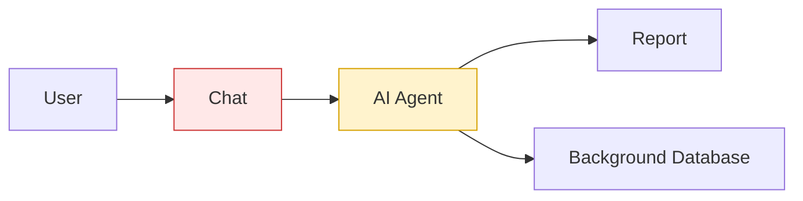
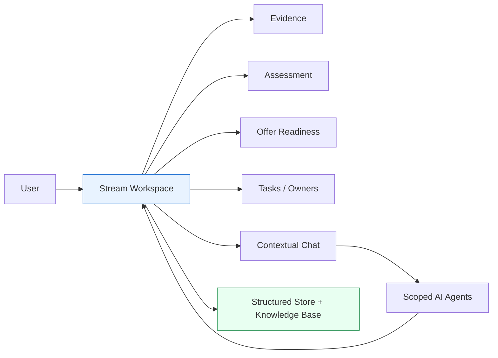
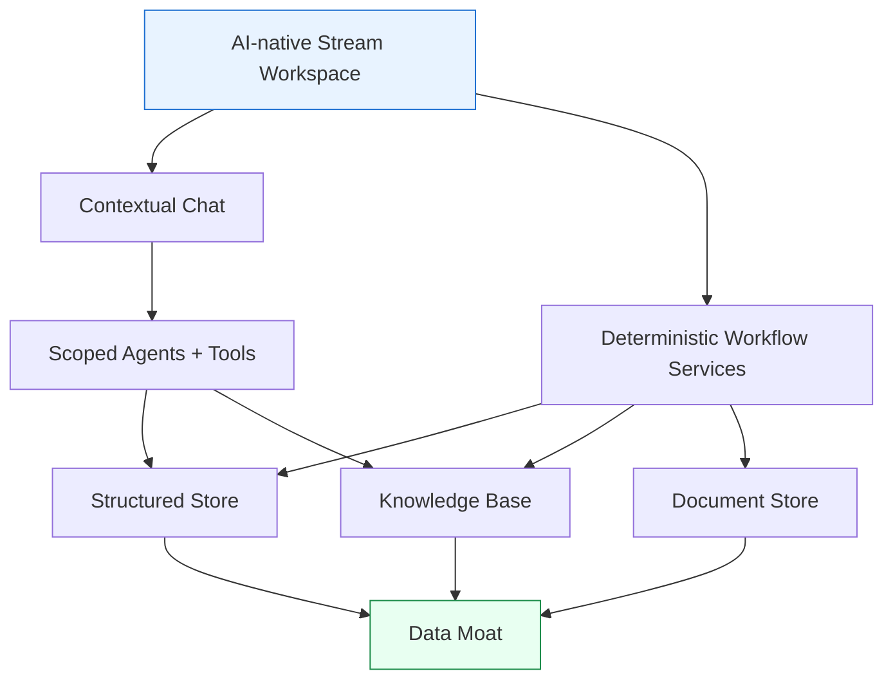

# Chat-First vs Workspace-First

_Last updated: April 30, 2026_

## Short answer

SecondStream should **not** be a chat-first product.

The better strategy is:

```text
Workspace-first, chat-enabled, data-moat-backed.
```

Meaning:

- The **workspace** is the product.
- **Chat** is one interface to operate the product.
- **AI agents** help with extraction, reasoning, drafting, and recommendations.
- **Deterministic software** owns state, workflow, review, permissions, offers, and auditability.
- The **data moat** compounds underneath through structured records, knowledge base, pricing, outcomes, and human corrections.

---

## 1. The core disagreement

| Question | Chat-first answer | Workspace-first answer |
|---|---|---|
| What is the product? | A chat with agents/skills | A system of record for streams/projects |
| Where does work live? | In conversations and generated reports | In streams, evidence, assessments, offers, tasks |
| How does the user operate? | Ask the AI repeatedly | Use workflow surfaces + contextual AI |
| What creates retention? | Chat history and reports | Data, workflows, team usage, outcomes, counterparties |
| What creates the moat? | Conversations stored in a KB | Structured workflow data + knowledge + outcomes |
| Main risk | Becomes another AI chat wrapper | More product work upfront |

---

## 2. Visual model

### Chat-first



**Problem:** the conversation is the center. The product depends too much on the agent remembering, reasoning, and regenerating correctly.

### Workspace-first



**Benefit:** the workspace is the system of record. AI operates inside the product instead of replacing the product.

---

## 3. Why chat-first is weaker

| Issue | Why it matters |
|---|---|
| Not a system of record | Brokers need stream status, owners, evidence, offers, tasks, and outcomes — not only messages. |
| Fragile memory | The agent must remember what changed, what was accepted, what was rejected, and which report is current. |
| Too AI-dependent | If the model forgets, hallucinates, or misses context, the workflow breaks. |
| Hard to audit | It is harder to know which facts came from evidence vs assumptions vs user corrections. |
| Weak multiplayer | Vendors, field agents, compliance, admins, and clients need shared objects and permissions, not one long chat. |
| Worse unit economics | Every meaningful action may require model calls, increasing cost. |
| Easier to commoditize | ChatGPT/Claude/custom GPTs will keep making prompts, tools, files, memory, and skills easier. |
| Lower retention | If value is mostly chat + reports, customers can copy prompts and leave more easily. |
| Harder to add features | Every new feature becomes another agent behavior instead of a product surface with clear state. |
| Admin dashboards become fragile | If dashboard numbers come from agents searching sessions, metrics depend on summaries and memory instead of reliable records. |
| Weak operational context | It is harder to know which client, stream, evidence, owner, and offer a chat belongs to unless these are explicit objects. |

---

## 4. Why chat sessions are a bad operating layer

A chat-first product tries to make sessions do too many jobs:

```text
Conversation
= intake
+ memory
+ database
+ workflow state
+ audit trail
+ report source
+ dashboard source
+ collaboration history
```

That is too much responsibility for a chat transcript.

### The practical problems

| Problem | Why it breaks down |
|---|---|
| Stream ownership | The system must infer which client/location/stream a message belongs to. |
| Source of truth | It is unclear whether truth lives in the latest message, report, summary, or agent memory. |
| Evidence tracking | It is harder to link each claim to files, SDSs, calls, notes, or human corrections. |
| Context limits | Long chats eventually hit context limits; summaries can lose important details. |
| Dashboard reliability | Admin dashboards should query structured records, not ask an agent to search sessions. |
| Feature growth | New features become prompt/agent complexity instead of clear product modules. |
| Auditability | It is hard to prove who changed what, when, and based on which evidence. |

A chat can assist the workflow, but it should not be the workflow database.

---

## 5. Why workspace-first is stronger

SecondStream wants to own the full stream/project lifecycle:

```text
Discovery → Qualification → Assessment → Offer → Vendor / Logistics / Compliance → Outcome → Learning Loop
```

A workspace-first product gives users one place to manage:

- leads,
- clients,
- streams,
- evidence,
- Discovery Briefs,
- Pending Review,
- assessments,
- offers,
- tasks,
- owners,
- vendors,
- pricing history,
- compliance issues,
- outcomes,
- institutional knowledge.

That creates deeper dependency than chat alone.

### Basic CRM is not a distraction

SecondStream does not need to become a full generic CRM, but it should own the basic commercial structure:

```text
Lead → Client → Location → Stream → Assessment → Offer → Outcome
```

This matters because AI becomes much better when it has structured operational context:

- Which client owns this stream?
- Which location does it come from?
- Who is the field agent?
- What previous streams has this client had?
- What vendors worked before?
- What pricing history exists?
- What is the current offer state?

Without these objects, the agent must reconstruct context from chat. That is fragile.

### Admin dashboards should be deterministic

Admin dashboards should not be powered by an agent reading chat sessions.

They should query structured data:

```text
active streams
streams by owner
missing information
offer readiness
blocked streams
cycle time
conversion by stage
outcomes
pricing benchmarks
```

AI can explain the dashboard or generate insights from it, but the numbers should come from deterministic records.

---

## 6. Where the moat infrastructure fits

The AWS/moat architecture is still important.

We should keep:

- structured store,
- knowledge base,
- document store,
- agent-run logs,
- outcome capture,
- pricing intelligence,
- security perimeter,
- audit logs,
- portability discipline.

But it should sit **under** the workspace.



The teammate's infrastructure is good. The issue is using chat as the main product surface.

---

## 7. AI vs deterministic software

| AI should do | Software should do |
|---|---|
| Extract data from files | Stream status |
| Summarize evidence | Owners and permissions |
| Suggest missing info | Review decisions |
| Compare similar cases | Offer state |
| Draft questions/reports | Tasks and deadlines |
| Flag risks | Version history |
| Recommend next actions | Audit logs |
| Generate assessments | Billing and monetization |
| Explain dashboards | Admin dashboard metrics |
| Answer context questions | Client/stream relationships |

SecondStream should be **AI-native**, not **AI-only**.

---

## 8. Monetization comparison

| Chat-first | Workspace-first |
|---|---|
| Competes with ChatGPT/Claude perception | Competes as vertical operating system |
| Harder to charge high SaaS prices | Easier to charge for workflow value |
| Costs scale with AI usage | AI cost is leveraged inside platform |
| Value is mostly answers/reports | Value is workflow, data, collaboration, outcomes |
| Easier to replace | Harder to leave once data/workflows live there |

---

## 9. Recommended positioning

Do **not** position SecondStream as:

```text
AI chat for waste brokers.
```

Position it as:

```text
AI-native operating system for regulated industrial streams.
```

Practical version:

```text
SecondStream helps brokers and operators turn incomplete stream data into assessed, evidence-backed, offer-ready opportunities.
```

---

## Final recommendation

The best strategy combines both views:

```text
Product surface: AI-native Stream Workspace
Interaction layer: Contextual chat
Agent layer: Skills and tools
Workflow layer: Deterministic systems
Moat layer: Structured data + knowledge base + outcomes
Security layer: AWS/IAM/audit/encryption
```

Final principle:

```text
The chat should operate the system.
The workspace should be the product.
The data moat should compound underneath.
```
