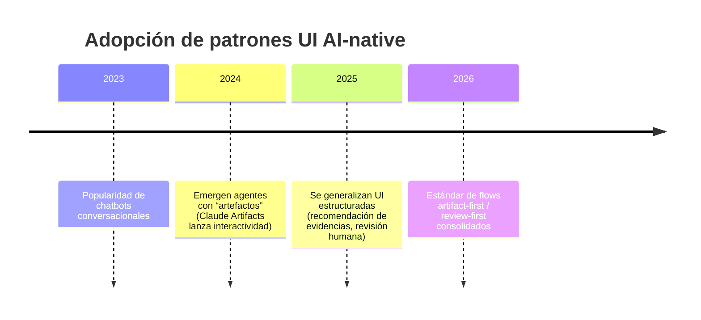
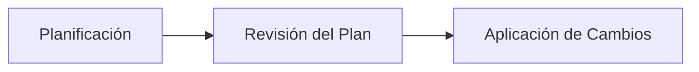

## Verdict  
Nuestra dirección *artifact-first, review-first, evidence-grounded* es **adecuada**, pues coincide con los patrones recomendados para UIs de agentes productivos. En lugar de un chat abierto o un formulario largo, conviene centrar el workspace en un único artefacto vivo (el *Discovery Brief*) con flujos claros de revisión. Este enfoque ya se ve en herramientas de 2026: por ejemplo, se aconseja gestionar “metas → tareas → subtareas” en un tablero en lugar de un chat【67†L300-L304】. Sin embargo, la IU actual aún muestra rasgos de dashboard tradicional (demasiada información junta) que hay que ajustar para lograr la simplicidad y pulcritud deseadas.  

## Executive summary  
Las UIs AI-native modernas (2026) tienden a usar superficies de trabajo minimalistas centradas en artefactos claros y secciones bien definidas. Productos reales ilustran estos patrones: Claude Artifacts despliega contenido grande en un panel separado【69†L40-L44】, Perplexity muestra citas numeradas junto a cada respuesta【40†L49-L57】, Notion AI fomenta plantillas estructuradas con fuentes y validación humana【29†L369-L377】, y Harvey organiza revisiones en tablas especializadas【68†L63-L70】. En contraste, lo que debemos evitar son interfaces tipo “chat-only” sin controles, dashboards recargados o formularios excesivos. En el caso de SecondStream, el *Discovery Brief* como artefacto principal es la dirección correcta, pero su diseño debe simplificarse: usar más espacio en blanco, tipografía prominente y secciones de contenido claramente separadas. También es esencial mostrar evidencia y opciones de revisión de forma contextual, sin sobrecargar la vista. Los cambios de mayor impacto incluyen eliminar formularios largos, destacar secciones clave, añadir panel de evidencias y un mecanismo visible de aprobar/rechazar sugerencias. A continuación resumimos patrones observados, anti-patrones, una auditoría de la UI actual, y recomendaciones concretas.

## Comparative patterns table  

| Producto  | Patrón observable                      | Implementación                                                        | Captura/URL / Ejemplo      | Relevancia para SecondStream                                 |
|-----------|---------------------------------------|----------------------------------------------------------------------|---------------------------|-------------------------------------------------------------|
| **Claude (Anthropic)**   | Artefactos secundarios separados    | Cada vez que genera un artefacto grande, lo muestra en una ventana dedicada a la derecha del chat【69†L40-L44】【69†L110-L113】. El usuario puede editarlo sin perder el contexto original. | Claude Help Center: sección “What are artifacts…”【69†L40-L44】 | Resalta la idea de mostrar el *Discovery Brief* fuera de un chat, con edición directa. |
| **Linear**  | Integración de agente en flujo       | Agente accesible mediante un chat en esquina o comandos tipo “/skill”. La UI permite invocar *Skills* (flujos prefabricados) desde el chat【15†L0-L2】. | Notas de lanzamiento (blogs) | Ejemplo de agente intrusivo en workspace. Indica qué evitar: no queremos una IU dominada por chat. |
| **Notion AI (2026)** | Plantillas estructuradas con fuentes y validación | Usa plantillas predefinidas (reuniones, briefs, etc.) con secciones fijas: metas, evidencias, fuentes, puntos de validación. Inculca reglas de calidad (“requiere validación humana”) para cada sección【29†L369-L377】. | Blog de Notion 3.4 (mar 2026)【29†L369-L377】 | Destaca el valor de tener un artefacto con secciones rígidas (hechos, asunciones, recomendaciones) y fuentes citadas. |
| **Harvey**  | Tablas de revisión estructuradas    | Permite crear tablas de revisión con archivos cargados (dentro o fuera de un vault). Las tablas tienen columnas configurables para resumir puntos clave y fuentes【68†L63-L70】. | Release notes Harvey (Review Tables)【68†L63-L70】 | Muestra cómo listar pendientes de revisión en filas/tablas, útil para *Pending Review* de SS. |
| **Glean**   | Búsqueda con confianza               | Integra puntajes de confianza y flujos de verificación de contenido (RAG interno). Prioriza fuentes autorizadas y permite filtros de fiabilidad. [No hay UI pública específica]. | Publicaciones de Glean (generales)【36†L418-L427】 | Inspira ofrecer señales de “autoridad” o indicadores de confianza junto a respuestas. |
| **Perplexity** | Respuestas con citas evidentes      | Al ser esencialmente una buscador AI, adjunta siempre enlaces numerados a fuentes web por defecto【40†L49-L57】. Mostró que para preguntas objetivas casi siempre hay citas. | Blog de Perplexity (opinión, Feb 2026)【40†L49-L57】 | Modelo de “evidence-grounded”: seguir su patrón de panel de fuentes numeradas para validar cada afirmación del agente. |
| **Cursor**  | Gestión de contexto histórico        | Ofrece comando `@Past Chats` para arrastrar contexto previo al chat【62†L167-L169】. Así el agente reutiliza conversaciones antiguas sin copiarlas. | Blog Cursor (Best practices)【62†L167-L169】; interfaz *Past Chats*【63†embed_image】 | Patrón de UI para referenciar contexto antiguo. Similar: podríamos mostrar “memoria” o historial resumido del caso. |
| **v0 / Bolt / Lovable** | Generación de UI por prompt       | Herramientas que, a partir de descripciones en lenguaje natural, generan componentes React/Tailwind o apps completas【42†L65-L73】. **Observación:** casi todas usan el mismo look (azul/Inter/grid)【52†L81-L85】. | Blog Muzli “Vibe Design” (Abr 2026)【52†L81-L85】 | Demuestra cómo la IA puede crear diseños rápidos (útil para prototipos) y también alerta de no conformarse con la UI genérica que generan por defecto. |

## Strong patterns to adopt  
- **Tablero de tareas y resultados (“Taskboard”)** – Organizar la interfaz como un flujo de trabajo con metas, tareas y subtareas claramente visibles【67†L300-L304】. En lugar de un chat de texto, mostrar lanes o tarjetas con estados (hecho/pendiente), responsable y fecha. Esto facilita la supervisión rápida de “qué se ha hecho y qué falta” sin leer conversaciones.  
- **Panel cronológico de actividades** – Incluir un registro o timeline de todas las acciones del agente (qué hizo, cuándo) con enlaces a cada artefacto asociado【67†L308-L315】. Permitir filtrar o “anclar” el paso actual. Así el usuario ve el historial de decisiones del agente y puede volver a cualquier artefacto generado (por ejemplo, el brief anterior) para auditarlo.  
- **Flujo en dos fases (Plan → Revisar → Ejecutar)** – Mostrar primero un plan de la acción propuesta por el agente y requerir la validación del usuario antes de aplicarlo【67†L341-L348】. Este plan incluiría los datos y supuestos clave. Solo al aprobarlo, el agente procede a ejecutar y actualiza el *Discovery Brief*. Esto aplica especialmente a cambios sensibles (acuerdos, condiciones, etc.).  
- **Recibos de acción (diffs y deshacer)** – Cada vez que el agente aplica cambios, generar un “recibo” que detalle qué se modificó, dónde y cómo, incluyendo enlaces o resúmenes comparativos【67†L350-L357】. Por ejemplo, si el *Discovery Brief* se actualiza, el usuario debería poder ver antes/después o deshacer ese cambio. Esto construye confianza y permite auditar/rollback fácilmente.  
- **Panel de evidencia/proveniencia** – Adjuntar a cada afirmación del brief las fuentes o datos que la respaldan. Similar a Perplexity, mostrar citas numeradas con enlaces clicables【40†L49-L57】. En la UI, podría haber un panel lateral o tooltip que liste documentos, URLs o extractos que prueban el punto. Esto muestra que la IA está basada en hechos, no en conjeturas【67†L358-L366】.  
- **Marcas de “checkpoint” humano** – Diseñar la revisión humana como paso explícito: por ejemplo, un estado “Pending Review” donde el agente propone cambios o recomendaciones, y el usuario los aprueba/rechaza uno a uno【67†L369-L377】. Incorporar botones “Aceptar/Rechazar” en cada sugerencia (patrón maker-checker visible)【67†L463-L468】. Así las interacciones con la IA son colaborativas y bajo control.  
- **Representación de roles de agentes** – Aunque se use un único “Discovery Completion Agent” visible, ofrecer indicios de especialización: un card o icono con nombre y rol del agente superviso【67†L378-L386】. Esto puede mostrar, por ejemplo, qué parte del proceso lleva a cabo (resumen, análisis, etc.). En sistemas multiagente, se usarían tarjetas para cada sub-agente; aquí bastaría un resumen del “modo” actual del agente visible.  
- **Estructura clara de artefacto** – Darle al *Discovery Brief* una estructura de secciones identificables (p.ej. “Qué sabemos”, “Qué falta”, “Conflictos”, “Próximos pasos”). Cada sección separada por espacios y encabezados destacados. Etiquetar cada punto interno como hecho, suposición o recomendación, al estilo de plantillas editoriales【29†L369-L377】. Esto hace el texto más escaneable y alineado con el flujo mental del broker.  
- **Controles de autonomía y pausa** – Aunque no pediste explícitamente, es útil incluir controles evidentes: botones “Pausar”/“Detener” para detener al agente en ejecución【67†L316-L324】, y quizá un selector rápido de nivel de autonomía (por defecto bajo hasta ganar confianza)【67†L325-L334】. De este modo el usuario jamás se ve sorprendido por acciones en curso.  
- **Memoria transparente** – Exponer qué información ha almacenado el agente sobre este caso y permitir editarla o borrarla【67†L403-L410】. Por ejemplo, mostrar breve “qué recuerda el agente de esta cuenta” o los archivos cargados, para que el usuario confirme la base de conocimiento actual.  
- **Estados de la aplicación** – Diseñar explícitamente estados vacíos o de error: p.ej. mensajes claros cuando no hay pendientes o cuando falla una carga. Las UIs generadas por IA suelen omitir esto【52†L135-L139】, pero un producto premium debe manejar cada caso visible (“No hay acciones pendientes”, “Error al recuperar evidencia”, etc.).  
- **Look & feel premium** – Aplicar un estilo moderno: tipografías limpias (podría ser la fuente de marca o similares a Inter con pesos variados), paleta con acentos sutiles (no solo azul genérico) y botones/iconos de alta calidad. Evitar el aspecto genérico de “vibe design” que genera la IA automáticamente (tonos azules predeterminados, iconos básicos de tablero)【52†L81-L85】. Incluir micro-interacciones (transiciones suaves, hover states) para dar sensación de pulido y responsividad.  

## Anti-patterns to avoid  
- **Interfaz centrada en chat** – No plantear la UI como una conversación estilo mensajería. El chat-first fue criticado como “sólo para demos”【67†L300-L304】. Específicamente, no permitir que la experiencia gire alrededor de mensajes libres del agente. No es sólo que queremos evitar mostrar la transcripción de chat; debemos evitar que el usuario “hable” al agente como vía principal.  
- **Formularios largos o wizard por defecto** – No someter al usuario a cuestionarios extensos ni asistentes paso a paso. El workspace actual criticado en los docs ya se queja de “formulario largo y pesado”. En lugar de ello, los datos se deben capturar de forma just-in-time o secundaria, sin fragmentar la experiencia central.  
- **Sobrecarga de dashboard/métricas** – No convertir la pantalla en un panel multi-gráfica o un reporting en vivo. Los datos analíticos deben figurar sólo si el usuario los necesita. La guía indica evitar un “mission-control dashboard” 【44†L38-L44】. Pantallas saturadas de cuadros y estadísticas empresariales dificultan la labor.  
- **Diseño genérico (blue + Inter)** – No usar de forma acrítica el estilo estándar de IA. Como advierte el artículo *“Vibe Design 2026”*, muchas UIs generadas por IA tienen el mismo look (azul, fuente Inter, tabla de datos)【52†L81-L85】. Para un producto B2B premium, esto resulta monótono y “barato”. Es un anti-patrón aceptar ese template sin personalizar branding y jerarquía visual propia.  
- **Sucumbir al “chain-of-thought” en UI** – No mostrar al usuario todo el razonamiento del modelo (los tradicionales “halos de texto”). En su lugar, use un panel de evidencia filtrada【67†L358-L366】. La idea es evidenciar sólo las fuentes relevantes, no exponer la lógica interna al completo. Mostrar pensamientos de IA es confuso y poco útil para la mayoría de usuarios.  
- **Ignorar la revisión humana** – No permitir que el agente modifique el artefacto sin control. Si hay outputs sin revisar (como sugerencias o ediciones automáticas), le quitan al usuario el sentido de control. Hay que evitar reglas automáticas ocultas; todas las acciones importantes deben pasar primero por el *Pending Review*.  
- **Usar demasiadas secciones/panels a la vez** – Evitar añadir columnas o secciones adicionales fijas. En los docs se advierte contra 3 columnas permanentes, sidebars pesados o múltiples paneles visibles simultáneamente. Reducir la IU a lo esencial evita distracción visual.  
- **No manejar excepciones de UI** – Evitar lanzar una pantalla vacía o con errores sin guías. Patrones AI-vibe típicamente no contemplan estados vacíos o errores【52†L135-L139】. Esto rompe la fluidez cuando algo falla. Un UI premium siempre debe tener layouts “vacíos” o de “timeout” amigables.  

## Audit of current UI  
- **Qué está mal:** La maqueta actual resulta **muy densa y administrativa**. Hay múltiples columnas de texto con “facts” y “needs review” apretujados, muchos separadores rígidos (líneas y tarjetas frías) y muy poco espacio en blanco. El diseño recuerda a una tabla contable, no a un brief narrativo. Los controles (botones de refresh, añadir) están presentes pero no resaltan visualmente; los estados de sección (“What we know”, “What is missing”) se ven monocromos y con tipografía poco destacada. En conjunto, el aspecto es administrativo y no “premium”.  
- **Qué está regular:** Se cumple el esquema básico: existe un artefacto central dividido en secciones y un panel de contexto (evidencias). Es positivo que no haya un chat real ni un wizard visible. La jerarquía básica está (encabezado con status, resumen ejecutivo, luego detalle de puntos). Sin embargo, la presentación de contenidos podría mejorarse: actualmente todos los puntos tienen el mismo formato y peso visual, lo cual dificulta escanear rápidamente lo más importante.  
- **Qué va bien:** La idea de un *Discovery Brief* central sí alinea con la visión: el broker ve la comprensión actual del caso de un vistazo. También existe un concepto de “Pending review” en el encabezado, indicando control humano. El panel derecho (“Evidence Context”) muestra pruebas asociadas al ítem seleccionado, lo que es útil. En general, la UX no cae en ser un chat ni un dashboard flotante. El flujo básico (ver brief, revisar, plan, próxima acción) es correcto en su estructura, solo necesita una visualización más refinada.  

## Recommended direction for SecondStream  
- **Layout:** Mantener un layout de **dos columnas**: una columna principal amplia (~70%) con el *Discovery Brief* y sus controles, y un rail derecho (~30%) con evidencias y próximas acciones. Evitar sidebars extra o paneles apilados. El encabezado debe ser minimalista (título, estado, botones clave). No usemos más de dos áreas de contenido simultáneas.  
- **Jerarquía visual:** Destacar con tipografía más grande el título del stream y los títulos de sección (“Qué sabemos”, “Qué falta”, etc.). Usar negritas o color suave para diferenciar bloque título vs contenido. Resaltar el estado (“Pending review”, “Current”) con un color o ícono sutil. Agrupar cada sección en tarjetas o bloques con fondo tenue para aislar visualmente cada grupo de contenido.  
- **Espaciado:** Aumentar los márgenes y paddings. Cada punto del brief podría ir en una tarjeta con padding interno. Separar secciones con saltos de línea visibles. Los puntos de evidencia en el panel derecho también deben tener espacio suficiente y scroll independiente. Evitar que el texto toque los bordes o que las tarjetas se vean pegadas.  
- **Tipografía:** Usar una fuente legible y moderna (podría ser Inter u otra corporativa) con jerarquía clara (por ejemplo, 18px en títulos, 14-16px en texto, pesos diferenciados). Asegurarse de contrastes altos para B2B. No usar demasiados estilos distintos; una buena escala tipográfica basta. Incluir iconos o bullets estilizados para listas de puntos.  
- **Superficies:** Emplear bloques o tarjetas sutiles (bordes ligeros o sombras bajas) para cada entidad (punto del brief, ítem pendiente, evidencia). La superficie principal debería ser blanca o muy clara para sensación de limpieza. Evitar múltiples patrones visuales diferentes; seguir un sistema de diseño coherente.  
- **Rail de contexto:** El panel de evidencias y próximas acciones debe ser colapsable/cerrable y distinguible (p.ej., fondo gris claro). Debe mostrar títulos (“Evidencia relacionada”, “Próximas Acciones”) y permitiendo expandir ítems. Este rail apoya al contenido principal, así que no debe robar enfoque ni usar colores vibrantes.  
- **Estados (vacío/precarga):** Diseñar pantallas intermedias: por ejemplo, un mensaje amigable cuando no haya evidencia vinculada (“Aún no hay evidencia asociada”), o al cargar nueva información. Esto evita la sensación de que la IU “se rompió”. Siempre incluir feedback visual al iniciar o terminar procesos (carga, éxito, error).  
- **Evidence/Provenance:** Mostrar iconos de fuente junto a cada dato en el brief. Al hacer clic, abrir el documento o una vista previa en el panel derecho. Incluir metas datos (fecha, autor) si aplica. En el panel de evidencias, listar cada fuente con un breve excerpt y enlace. Permitir “desafiar” la fuente con un botón de refetch o pedir alternativa.  
- **Representación del agente:** Incorporar un pequeño avatar o ícono de *Discovery Completion Agent* en el encabezado o como tarjeta flotante. Podría decir: “Agente: DiscoverBot (activo/pausado)”. Esto afirma que hay un actor AI controlando el brief. No usar burbujas de chat; el agente se percibe como “modo de acción” o simplemente en la narrativa (“El agente completó 3 fact checks”).  
- **Modelo de interacción:** Priorizar acciones directas y botones. Por ejemplo, el botón “Complete Discovery” (como en la maqueta) debe ejecutar el plan revisado. Para cada recomendación, mostrar botones aceptar/rechazar. El usuario debe poder editar el texto del Brief inline. Evitar pasos ocultos; cada función clave (e.g., buscar nueva evidencia, añadir acción) debe ser un botón visible o menú sencillo. Incluir controles de pausa/reanudar si el agente corre en segundo plano. Respetar el flujo *Plan – Revisar – Aplicar* tal como en el diagrama:  

## 5 highest-leverage changes  
1. **Eliminar el formulario principal**: Quitar la UI de formulario largo. Mover esos campos a una pestaña oculta (“Structured Capture”) y centrar todo en el *Discovery Brief*. Esto simplifica inmediatamente la pantalla.  
2. **Reestructurar el Brief en bloques**: Separar claramente “Lo que sabemos”, “Lo que falta”, “Conflictos” y “Próximos pasos” en tarjetas distintas con títulos grandes. Esta simple división hace que el usuario entienda la información al instante.  
3. **Agregar panel de evidencia integrado**: Introducir un rail lateral donde, al seleccionar un punto del brief, se muestre su evidencia fuente (documento, cita web). Esto no altera la pantalla principal pero aporta transparencia y confianza.  
4. **Implementar la revisión visible**: Cambiar la sección “Pending Review” por una lista interactiva donde cada sugerencia del agente tenga botones de “Aceptar/Rechazar”. Así evitamos sorpresas; el usuario controla qué se incorpora al brief.  
5. **Pulir estilos visuales**: Aplicar más espacio, tipografía consistente y colores suaves de acento. Por ejemplo, usar tonos corporativos en íconos de estado (verde, amarillo) y redondear bordes. Estos detalles levantan la interfaz de “cosa de intranet” a “aplicación premium” en 2026【52†L81-L85】.  

Estos cambios maximizan el valor: eliminan complejidad, mejoran la escaneabilidad y refuerzan la credibilidad al incluir evidencias. La combinación de un artefacto central bien diseñado con un flujo de revisión claro transformará la UI de enterprise pesada a una experiencia AI-nativa de verdad.
