# SecondStream — Market Approach & Product Direction

_Last updated: April 30, 2026_

## 0. One-line thesis

**SecondStream should become the AI-native operating workspace for regulated industrial streams — not a chat product.**

The product should help brokers and operators turn messy stream information into structured, evidence-backed, assessed, offer-ready opportunities.

```text
Workspace is the product.
Chat operates the product.
Agents execute scoped work.
Deterministic software owns state.
The data moat compounds underneath.
```

---

## 1. Executive summary

SecondStream is on the right path.

The market does not need another CRM, generic marketplace, document generator, or AI chat wrapper. Waste and secondary-stream brokers need a system that owns the workflow across incomplete information, evidence, clients, field agents, vendors, logistics, compliance, offers, and outcomes.

The product direction is:

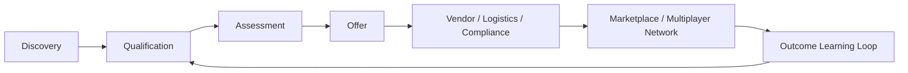

The immediate product shift is:

```text
From: Stream Detail as form-first qualification page
To:   Stream Workspace as AI-native operating surface
```

---

## 2. Why this is the right AI-native approach in 2026

Deep Research on current AI-native products and startups confirms the pattern:

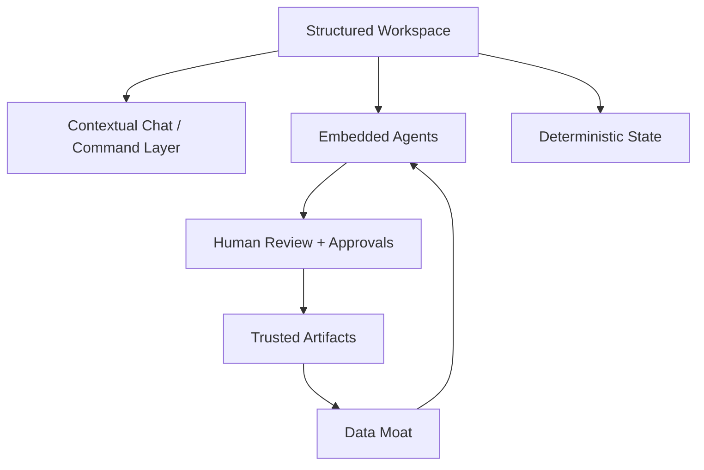

The strongest AI-native products are **not** pure chat interfaces. They combine:

| Pattern | Why it matters for SecondStream |
|---|---|
| **Workspace-first** | The stream needs a durable home, not a temporary conversation. |
| **Chat-enabled** | Chat should ask questions, trigger tools, and explain context inside a stream. |
| **Artifacts / canvas** | Discovery Brief, Assessment, Evidence, and Offer Readiness should be editable artifacts. |
| **Human-in-the-loop** | AI proposes; humans approve canonical truth. |
| **Provenance** | Important claims need sources. |
| **Agent activity** | Users should see what the agent did and what changed. |
| **Deterministic state** | Dashboards, stages, tasks, offers, and permissions must come from the database. |
| **Governed actions** | External actions require permissions, approvals, and receipts. |
| **Data moat loop** | Outcomes, pricing, vendor fit, corrections, and compliance patterns make the product stronger. |
| **MCP readiness** | Internal tools should later become safe external interfaces for ChatGPT/customer agents. |

### Startup patterns to copy/adapt

| Startup/product pattern | What works | What to adapt |
|---|---|---|
| **Cursor / Factory / Devin / Replit Agent** | Agent work is visible in a workspace. | Add Agent Activity: tools used, changes, progress, outputs, review needed. |
| **Linear / Pylon** | Structured object pages remain the operating layer. | Treat each Stream as an object page with owner, stage, blockers, timeline, evidence, tasks, offers. |
| **Glean / Hebbia / Harvey** | Answers are trusted because they show sources. | Make evidence/provenance mandatory for facts, risks, assumptions, recommendations. |
| **Ramp** | AI is embedded into high-value workflows with policy and approvals. | Use AI for offer readiness, vendor fit, missing info, pricing assumptions; keep approvals explicit. |
| **Clay** | Agents are powerful when attached to structured data and repeatable workflows. | Use structured stream/client/vendor data, not chat sessions, as the agent operating layer. |
| **OpenAI Apps / MCP / Stripe agentic commerce** | Agents execute real actions through governed tools. | Build internal tools first; expose read-only MCP later; controlled writes/actions after approvals. |
| **Palantir / Salesforce / ServiceNow** | Enterprise AI sits on operational systems, permissions, workflows, and audit logs. | Keep deterministic services responsible for state, dashboards, permissions, stages, and actions. |

### 2026 anti-patterns to avoid

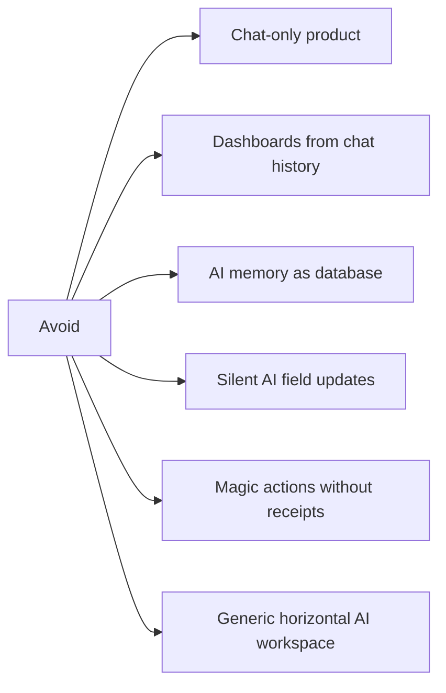

The updated product principle:

```text
Do not make users manage the stream through chat.
Make the stream workspace intelligent enough that chat becomes the fastest way to operate it.
```


---

## 3. Platform risk update — April 30, 2026

OpenAI's April 2026 Codex direction changes the competitive landscape.

Codex is no longer positioned only as a coding tool. It is moving toward a general work agent layer: work automation, documents, spreadsheets, slides, recurring tasks, memory, computer use, browser use, plugins, MCP servers, reusable skills, and permissioned actions.

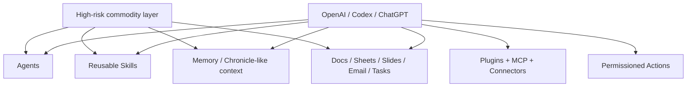

### What this means

Anything that can be described as a generic AI work assistant is becoming hard to defend.


> Note: even a waste-specialized chat-first product is still risky if chat and AI become the main operating layer. The durable advantage must come from waste-specific objects, workflows, evidence, pricing, outcomes, compliance state, and counterparties — with AI embedded in controlled places.

| Product idea | Risk now | Why |
|---|---:|---|
| Chat with agents | Very high | ChatGPT/Codex already provide shared agents and long-running workflows. |
| Skills library | Very high | Codex has reusable skills and a skill ecosystem. |
| Generic memory | Very high | Codex is adding memory and screen/context-aware workflows. |
| Document/report generator | Very high | Codex for Work directly targets docs, summaries, briefs, decks, spreadsheets. |
| Email/task automation | Very high | Codex for Work and workspace agents target recurring work and follow-ups. |
| Generic agentic workspace | High | Codex desktop is becoming a general agentic workspace with connectors and MCP. |
| Vertical system of record | Lower | Codex needs domain systems to operate against. |
| Regulated stream workflow | Lower | Requires domain data, stages, compliance, vendors, pricing, and outcomes. |
| Marketplace/network layer | Lower | Requires counterparties, trust, data history, and transaction workflows. |

### Updated strategic rule

```text
If Codex can do it with docs, spreadsheets, Slack, email, memory, skills, and MCP,
it should not be SecondStream's core product.
```

SecondStream's core should be what Codex and other agents need to use:

```text
Clients
Locations
Streams
Evidence
Assessments
Offer Readiness
Vendors
Pricing
Outcomes
Compliance State
Marketplace Actions
```

### Product implication

The product should become more vertical, not more generic.

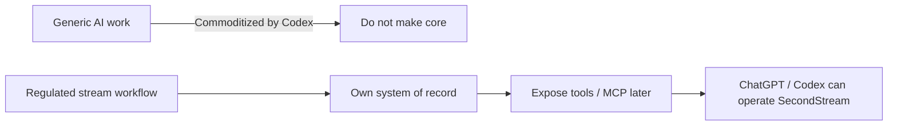

The best future position is:

```text
Codex/ChatGPT = horizontal agent layer.
SecondStream = vertical operating/data layer for regulated streams.
```


### What to add, change, or rethink now

| Area | Decision | Why |
|---|---|---|
| **Add** | Canonical Stream Workspace as the core product surface. | This is the vertical object Codex cannot provide generically. |
| **Add** | Vendor, pricing, outcome, and compliance data capture from day one. | These create the moat and make recommendations better over time. |
| **Add** | Tool/API layer around stream objects. | Lets internal agents and future MCP operate trusted data safely. |
| **Add** | Agent Activity + approvals + receipts. | Users need to know what AI did before trusting actions. |
| **Change** | Treat chat as an operation layer, not a product layer. | Chat is increasingly commoditized by OpenAI/Codex. |
| **Change** | Treat reports/docs as outputs, not the main artifact. | Codex for Work can already generate briefs, docs, spreadsheets, and updates. |
| **Change** | Make dashboards deterministic. | Admin metrics should query structured records, not agent memory. |
| **Rethink** | Generic skills marketplace. | Skills are becoming platform infrastructure. Build vertical tools instead. |
| **Rethink** | Generic workflow automation. | Only automate workflows that require SecondStream's stream data, permissions, evidence, and domain state. |
| **Rethink** | Memory as moat. | Generic memory is not enough; approved vertical facts and outcomes are the moat. |

---

## 4. What we have today

SecondStream already has the right backbone:

| Current product area | What it gives us | Limitation today |
|---|---|---|
| **Discovery Wizard** | Captures stream information from files/text/audio/AI extraction. | Mostly intake; not yet a living operational workspace. |
| **Leads & Clients** | Basic commercial/account structure. | Needs deeper connection to streams, outcomes, and knowledge. |
| **Streams** | Central unit of work. | Stream Detail is still too form-first. |
| **Stream Detail** | Qualification page for stream data. | Needs to become the main AI-native workspace. |
| **Offers** | Commercial next step. | Needs stronger assessment/offer readiness before offer creation. |
| **Files / contacts / suggestions / AI processing** | Early evidence and AI foundation. | Needs provenance, review queue, agent runs, and artifact persistence. |

Current product shape:

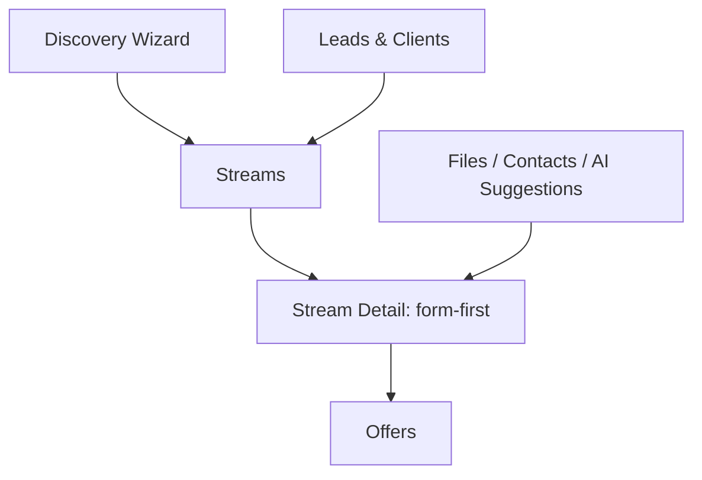

---

## 5. What changes

The change is not “add chat to Stream Detail.”

The change is:

```text
Turn Stream Detail into the AI-native workspace for the stream.
```

### From current state to target state

| Today | Target |
|---|---|
| Form-first Stream Detail | Stream Workspace as primary surface |
| AI suggestions as helper | AI-generated insights routed into review/artifacts |
| Files attached | Evidence with source links and provenance |
| Manual qualification | Living Discovery Brief + Assessment Mode |
| Offer after discovery | Offer Readiness before offer creation |
| Chat as possible feature | Contextual chat operating the workspace |
| No durable agent history | Agent Runs + Brief Versions + Human Corrections |
| Dashboards from app state only partially | Deterministic admin dashboards from structured data |

### Target Stream Workspace

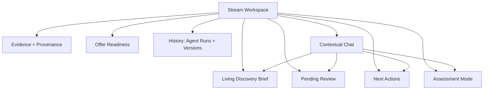

Recommended navigation:

```text
Stream Workspace
├── Overview
│   ├── Discovery Brief
│   ├── Pending Review
│   ├── Next Actions
│   └── Offer Readiness
├── Structured Capture
│   └── Existing form / questionnaire
├── Evidence
│   ├── Files
│   ├── Notes
│   ├── Contacts
│   └── Source links
├── Assessment
│   ├── Readiness
│   ├── Risks
│   ├── Missing info
│   ├── Vendor fit
│   └── Commercial assumptions
└── History
    ├── Agent Runs
    ├── Brief Versions
    └── Human Corrections
```

The current form should stay, but become **Structured Capture** — a secondary surface for completeness and manual edits.

---

## 6. Core product objects

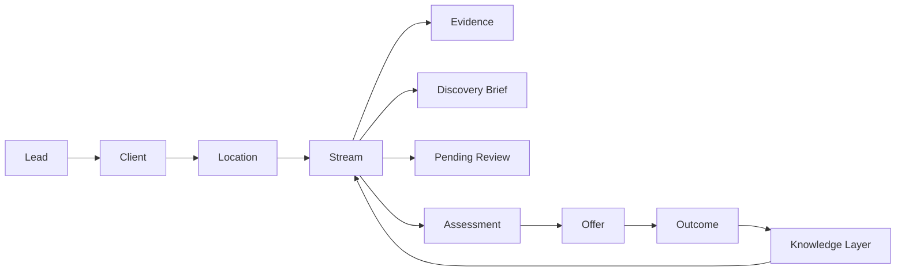

| Object | What it does | Why it exists |
|---|---|---|
| **Lead** | Early potential opportunity. | Do not force unqualified interest into a client/stream too early. |
| **Client** | Company/account relationship. | Stable commercial context across contacts, locations, streams, offers, outcomes. |
| **Location** | Physical site. | Streams depend on geography, permits, logistics, facility type, constraints. |
| **Stream** | Core unit of work. | Main object SecondStream should own. |
| **Evidence** | Files, SDSs, notes, transcripts, photos, lab data, extracted facts. | Makes claims traceable. |
| **Discovery Brief** | Living summary of knowns, unknowns, assumptions, conflicts, risks. | Gives the team shared context fast. |
| **Pending Review** | AI facts/suggestions requiring approval. | Keeps AI useful but controlled. |
| **Assessment** | Readiness, risks, missing info, vendor fit, compliance, commercial potential. | Turns discovery into decision support. |
| **Offer** | Commercial proposal/quote/next transaction. | Connects workflow to revenue. |
| **Next Action** | Task/blocker/owner. | Makes the product operational. |
| **Vendor / Counterparty** | Processor, buyer, hauler, compliance partner. | Enables multiplayer workflow and future marketplace. |
| **Outcome** | Accepted/rejected/priced/moved/lost/blocked/converted. | Essential for the data moat. |
| **Knowledge Layer** | Structured records, docs, transcripts, pricing, outcomes, agent runs. | Makes the platform smarter over time. |
| **Contextual Chat** | Stream-aware questions and commands. | Chat operates the system, but does not replace it. |

---

## 7. What is missing

| Missing layer | Why it matters | Priority |
|---|---|---:|
| **Living Discovery Brief** | Primary artifact for understanding a stream. | P0 |
| **Pending Review** | Converts AI outputs into controlled human-approved truth. | P0 |
| **Evidence + provenance** | Builds trust and auditability. | P0 |
| **Next Actions** | Turns insights into operational work. | P0 |
| **Brief versions + human corrections** | Shows what changed and why. | P1 |
| **Agent runs ledger** | Makes AI behavior inspectable and debuggable. | P1 |
| **Assessment Mode** | Moves from discovery to decision support. | P1 |
| **Offer Readiness** | Prevents premature offers and improves conversion. | P1 |
| **Internal tool layer** | Foundation for agents and future MCP. | P1 |
| **Outcome capture** | Foundation for pricing/vendor/compliance moat. | P1 |
| **External collaborator workflows** | Enables multiplayer marketplace. | P2 |
| **MCP / ChatGPT access** | External AI access once permissions/tools are mature. | P2 |

---

## 8. Data moat

The moat is not just “we use AI.” The moat is the operational data accumulated while users work.

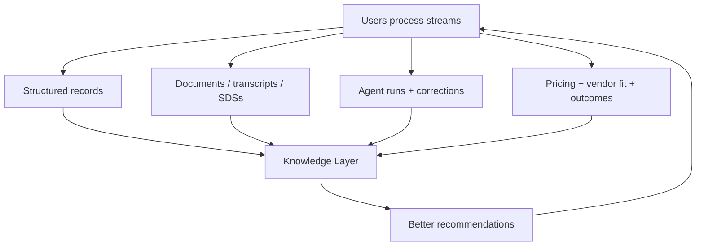

The data moat should capture:

- stream profiles;
- evidence and source artifacts;
- human-approved facts;
- rejected AI assumptions;
- vendor fit;
- pricing assumptions;
- offer outcomes;
- logistics/compliance blockers;
- successful and failed recommendations.

---

## 9. Roadmap

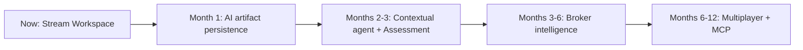

### Now — Stream Workspace

- Make Stream, Evidence, Assessment, Offer Readiness, Vendors, Pricing, and Outcomes the canonical objects Codex cannot own.
- Make Discovery Brief the primary view.
- Move existing form into Structured Capture.
- Add Evidence/provenance.
- Add Pending Review.
- Add Next Actions.

### Month 1 — Artifact persistence

- Persist Discovery Brief versions.
- Persist brief points.
- Persist human feedback.
- Persist provenance references.
- Keep human approval for canonical updates.

### Months 2–3 — Contextual agent + Assessment

- Add contextual chat inside Stream Workspace.
- Add read-only agent tools.
- Generate missing-information analysis.
- Generate offer readiness.
- Add Assessment Mode v1.

### Months 3–6 — Broker intelligence

- Admin dashboard.
- Field-agent workload.
- Stream blockers.
- Offer pipeline intelligence.
- Vendor/compliance packets.
- Quote/vendor comparison.

### Months 6–12 — Multiplayer + MCP

- External collaborator portals.
- Vendor/hauler/compliance workflows.
- Marketplace coordination.
- Read-only MCP first.
- Controlled write/actions later.

---

## 10. Long-term vision

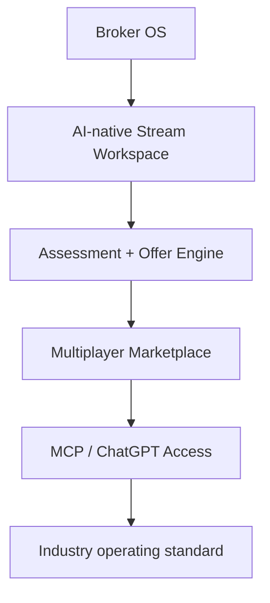

Long-term product formula:

```text
SecondStream = Broker OS + AI Workspace + Data Moat + Multiplayer Marketplace + MCP Layer
```

Example future MCP query:

```text
Admin: How many streams are field agents working on this week?
SecondStream MCP: Returns workload by field agent, tenant, role, and permission scope.
```

Important sequencing:

```text
Internal tools → read-only MCP → controlled write actions → governed commercial/compliance actions
```

---

## 11. Adjacent vertical expansion

Expansion should follow workflow similarity, not broad industry labels.

The reusable pattern:

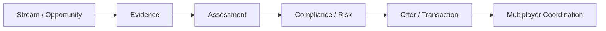

Best expansion order:

| Rank | Vertical | Why | Recommendation |
|---:|---|---|---|
| 1 | **Waste / secondary-stream brokers** | Current wedge. | Focus here first. |
| 2 | **Industrial byproducts / circular materials** | Very similar workflow: material specs, buyer/vendor fit, logistics. | First adjacent vertical. |
| 3 | **Industrial wastewater / pretreatment** | Strong stream/evidence/compliance fit. | Second vertical, compliance-heavy. |
| 4 | **Produced water / oilfield water** | Strong fit but specialized/geospatial. | Only with strong customer/domain expert. |
| 5 | **Energy / RECs** | More financial/contractual than stream-based. | Later optional expansion. |
| 6 | **Carbon / MRV** | Provenance-heavy but crowded and trust-sensitive. | Avoid near-term. |

Do not position as:

```text
SecondStream for water, energy, waste, carbon, and utilities.
```

Better positioning:

```text
AI-native workspace for regulated industrial streams.
```

---

## 12. Decision checklist for the team

When deciding features, ask:

| Question | If yes | If no |
|---|---|---|
| Could Codex do this generically with docs/email/Slack/skills? | Do not make it core. | Good candidate for vertical product value. |
| Does it make the stream more structured? | Build/consider. | Probably distraction. |
| Does it improve evidence/provenance? | Build/consider. | Be careful. |
| Does it move toward assessment or offer readiness? | Build/consider. | Maybe later. |
| Does it create outcome/pricing/vendor learning? | Build/consider. | Weak moat. |
| Does it depend on chat memory as truth? | Avoid. | Good. |
| Can the result be audited? | Good. | Do not ship for critical workflows. |
| Can a human approve/correct it? | Good. | Risky. |
| Does it help future MCP/tools? | Good. | Maybe not core. |

---

## 13. Strategic conclusion

SecondStream should avoid becoming:

```text
CRM + forms + AI summaries
```

or:

```text
Chatbot with agents and skills
```

The stronger target is:

```text
AI-native operating system for regulated industrial streams
```

The next decisive step is to make **Stream Workspace** the intelligent center of the platform.

If executed correctly, SecondStream can grow from a broker workflow tool into the operating layer that connects brokers, generators, vendors, logistics, compliance teams, admins, water/wastewater operators, circular materials teams, and eventually external AI clients through MCP.

---

## Key principles

1. **Workspace-first, not chat-first.**
2. **Chat operates the system; it is not the system.**
3. **Human-in-the-loop for truth.**
4. **Evidence-backed decisions.**
5. **Assessment before marketplace.**
6. **Deterministic state before autonomous actions.**
7. **Internal tools before external MCP.**
8. **Outcome capture creates the moat.**
9. **Expand by workflow similarity, not generic industry labels.**
10. **One core platform, vertical-specific packs.**

---

## References

### AI-native product references


- [OpenAI — Codex for Work](https://chatgpt.com/codex/for-work/)
- [OpenAI — Codex for almost everything](https://openai.com/index/codex-for-almost-everything/)
- [OpenAI — Workspace agents in ChatGPT](https://openai.com/index/introducing-workspace-agents-in-chatgpt/)
- [OpenAI — Apps SDK](https://developers.openai.com/apps-sdk/)
- [OpenAI — Apps SDK UX principles](https://developers.openai.com/apps-sdk/concepts/ux-principles)
- [OpenAI — MCP tools and connectors](https://platform.openai.com/docs/guides/tools-connectors-mcp)
- [OpenAI — Instant Checkout with Stripe](https://openai.com/blog/buy-it-in-chatgpt/)
- [Salesforce — Agentforce](https://www.salesforce.com/agentforce/)
- [ServiceNow — AI Agents](https://www.servicenow.com/products/ai-agents.html)
- [Palantir — AIP](https://www.palantir.com/platforms/aip/)
- [Microsoft — Microsoft 365 Copilot](https://www.microsoft.com/en-us/microsoft-365/copilot)
- [Glean — Agents](https://www.glean.com/product/agents)

### Adjacent vertical references

- [EPA — Industrial Wastewater / NPDES](https://www.epa.gov/npdes/industrial-wastewater)
- [EPA — Clean Water Act Compliance Monitoring](https://www.epa.gov/compliance/clean-water-act-cwa-compliance-monitoring)
- [EPA — NPDES eReporting](https://www.epa.gov/compliance/npdes-ereporting)
- [Klir — Water Management Software](https://www.klir.com/)
- [SwiftComply — Industrial Pretreatment Software](https://www.swiftcomply.com/pretreatment/)
- [Sourcewater / Sourcenergy Marketplace](https://www.sourcewater.com/marketplace/)
- [Rheaply — Materials Marketplace](https://rheaply.com/materials-marketplace/)
- [Recykal — Circular Marketplace](https://recykal.com/circular-marketplace)
- [Soldera — Renewable Energy Marketplace](https://www.soldera.org/corporate/marketplace)
