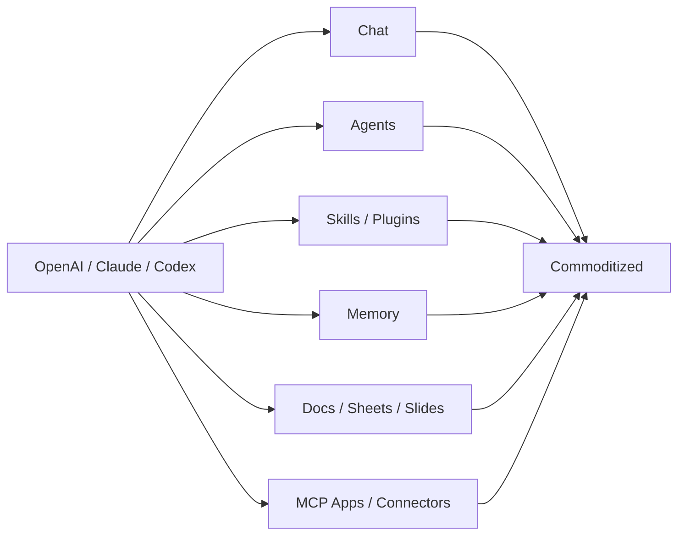
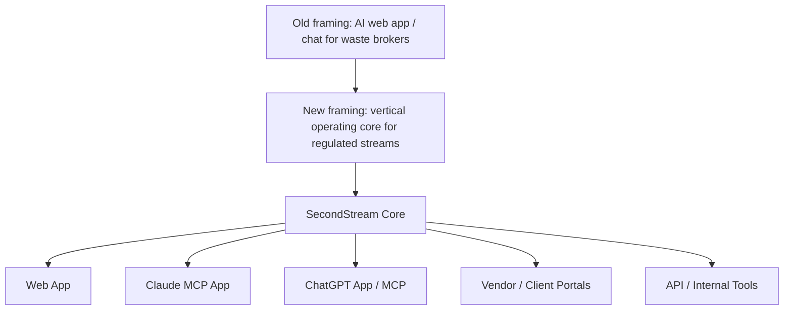
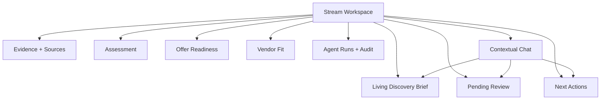
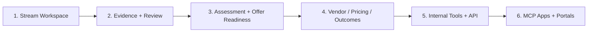

# SecondStream — One-Page Product Strategy

_Last updated: May 5, 2026_

## 1. The simple thesis

```text
Do not build the waste agent.
Build the operating system the waste agent must use.
```

SecondStream should be the **vertical operating core for regulated industrial streams**.

That means we own:

```text
clients + locations + streams + evidence + assessments + offers + vendors + pricing + outcomes
```

Claude, ChatGPT, Codex, and future agents can become interfaces to SecondStream, but SecondStream should remain the source of truth.

---

## 2. Why this matters now

OpenAI and Anthropic are turning generic AI layers into infrastructure.



So SecondStream should **not** compete mainly on chat, skills, memory, reports, or generic workflow automation.

---

## 3. The strategic shift



The web app still matters, but it is only one surface. The durable product is the core.

---

## 4. What SecondStream must own

| Must own | Why it matters |
|---|---|
| **Canonical Stream records** | The workflow needs a real source of truth. |
| **Evidence + provenance** | Every important claim needs a source. |
| **Pending Review** | AI outputs become human-approved truth. |
| **Assessment + Offer Readiness** | Moves discovery toward revenue. |
| **Vendor / Pricing / Outcome data** | Creates the moat. |
| **Compliance state** | Required for regulated workflows. |
| **Permissions + audit** | Required for enterprise trust. |
| **Tool/API layer** | Lets AI agents safely operate SecondStream. |

---

## 5. What Stream Workspace becomes



Chat helps operate the workspace. Chat is not the workspace.

---

## 6. Build vs avoid

| Build as core | Avoid as core |
|---|---|
| Stream Workspace | Generic chat assistant |
| Evidence/provenance | Generic skills marketplace |
| Review/approvals | Report generator as main product |
| Assessment/offer readiness | Memory as moat |
| Vendor/pricing/outcome layer | Dashboards from chat sessions |
| Deterministic dashboards | Generic workflow automation |
| Tool/API/MCP layer | AI-only workflow state |

---

## 7. Product roadmap



### Phase 1 — Stream Workspace

- Discovery Brief.
- Evidence/provenance.
- Pending Review.
- Next Actions.
- Structured Capture.

### Phase 2 — Trust layer

- Brief versions.
- Human corrections.
- Agent runs.
- Approval history.
- Audit trail.

### Phase 3 — Revenue layer

- Assessment Mode.
- Offer Readiness.
- Vendor fit.
- Pricing assumptions.
- Offer input preparation.

### Phase 4 — Moat layer

- Vendor responses.
- Pricing history.
- Won/lost outcomes.
- Compliance blockers.
- Similar-stream intelligence.

### Phase 5 — Platform layer

- Internal tools.
- Stable API.
- Read-only MCP.
- Controlled write actions.
- Claude/ChatGPT apps later.

---

## 8. Final positioning

Do not say:

```text
AI chat for waste brokers
```

Say:

```text
SecondStream is the vertical operating core for regulated industrial streams.
```

Practical version:

```text
SecondStream helps teams turn messy stream information into evidence-backed, assessed, offer-ready opportunities — then learns from every vendor response, price, and outcome.
```

AI-platform-aware version:

```text
SecondStream is the regulated-stream system of record that Claude, ChatGPT, Codex, and internal agents can safely operate through governed tools.
```

---

## 9. Decision rule

Before building a feature, ask:

```text
Could Claude/OpenAI do this generically with chat, docs, skills, memory, and MCP?
```

If yes, do not make it core.

Core features should create or improve:

```text
canonical stream data
+ evidence
+ workflow state
+ assessment
+ pricing/outcomes
+ vendor network
+ compliance trust
```
