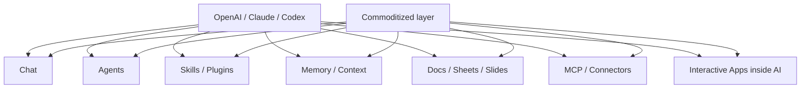
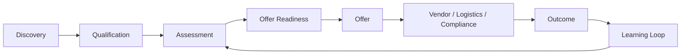
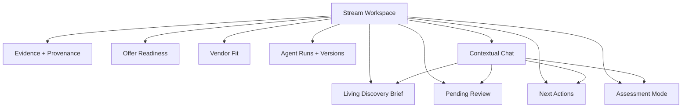
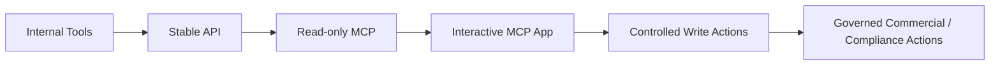
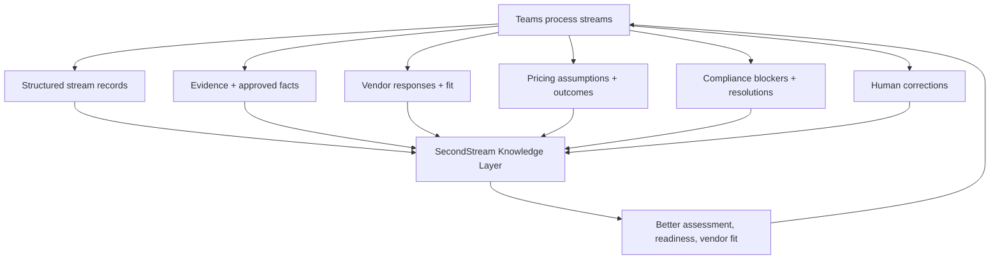

# SecondStream — Vertical Operating Core Strategy

_Last updated: May 5, 2026_


> **Quick team version:** see [`secondstream-vertical-operating-core-one-pager.md`](./secondstream-vertical-operating-core-one-pager.md) for the concise visual summary.

## 1. Core thesis

SecondStream should not be just:

```text
an AI chat
or a waste plugin
or a web app
```

SecondStream should become:

```text
The vertical operating core for regulated industrial streams.
```

That means SecondStream owns the canonical data, workflow, evidence, outcomes, permissions, and domain intelligence that AI agents need to safely operate waste/secondary-stream workflows.

The app users see can exist in multiple places:

```text
SecondStream Web App
Claude MCP App
ChatGPT App / MCP
Vendor Portal
Client Portal
Internal Admin Tools
API
```

But the product moat is the **SecondStream Core** underneath.

---

## 2. Why this matters now

As of May 5, 2026, the market is moving quickly:

- OpenAI Codex is expanding from coding into work automation, computer use, browser use, memory, automations, plugins, MCP, and reusable skills.
- Codex for Work targets briefs, documents, spreadsheets, emails, recurring tasks, project trackers, and workplace workflows.
- Claude is expanding into industry agent templates, Microsoft 365 add-ins, connectors, MCP apps, and interactive apps inside Claude.
- Anthropic's financial-services announcement shows agents, plugins, connectors, and embedded UI inside Claude for vertical workflows.

This means generic AI product layers are becoming infrastructure:



So SecondStream should not compete mainly on:

- chat;
- prompts;
- generic skills;
- generic memory;
- report generation;
- spreadsheets/decks/docs;
- generic workflow automation;
- generic agent templates.

Those layers are being absorbed by OpenAI, Anthropic, and other model platforms.

---

## 3. The important distinction

A Claude/OpenAI waste plugin can provide:

- waste-specific agents;
- waste-specific prompts;
- waste-specific skills;
- document analysis;
- report generation;
- forms or dashboards inside chat;
- MCP tools;
- workflow templates.

But a plugin still needs a real source of truth.

It needs to know:

- Which clients exist?
- Which locations belong to each client?
- Which streams are active?
- Which evidence was approved?
- Which assumptions were rejected?
- Which vendor already responded?
- Which offer is ready?
- Which pricing worked before?
- Which compliance issue blocked the deal?
- Which outcome happened?
- Which user has permission to act?

That is the role of SecondStream.

```text
Do not build only the waste agent.
Build the operating system the waste agent must use.
```

---

## 4. Updated product architecture

The product should be designed as:

```text
Vertical Operating Core + Multiple Interfaces
```



```mermaid
flowchart TD
  Core["SecondStream Core"]

  Core --> Data["Canonical Stream Data"]
  Core --> Evidence["Evidence + Provenance"]
  Core --> Workflow["Workflow State"]
  Core --> Review["Human Review + Approvals"]
  Core --> Vendors["Vendors / Counterparties"]
  Core --> Pricing["Pricing + Outcomes"]
  Core --> Compliance["Compliance Logic"]
  Core --> Actions["Governed Actions"]

  Core --> Web["SecondStream Web App"]
  Core --> Claude["Claude MCP App"]
  Core --> ChatGPT["ChatGPT App / MCP"]
  Core --> Portal["Vendor / Client Portals"]
  Core --> Admin["Admin Dashboards"]
  Core --> API["API / Internal Tools"]
```

The web app is important, but it is not the only interface.

The durable value is the core.

---

## 5. What SecondStream must own

| Layer | Why it matters |
|---|---|
| **Clients** | Stable commercial/account context. |
| **Locations** | Industrial streams depend on physical site context, logistics, permits, and constraints. |
| **Streams** | The core operational object SecondStream should own. |
| **Evidence** | Files, SDSs, notes, transcripts, photos, lab data, and approved facts. |
| **Discovery Brief** | Living summary of knowns, unknowns, risks, assumptions, and missing info. |
| **Pending Review** | AI suggestions become controlled human-reviewed truth. |
| **Assessment** | Readiness, technical risk, compliance risk, vendor fit, commercial potential. |
| **Offer Readiness** | Prevents premature offers and connects discovery to revenue. |
| **Vendors / Counterparties** | Enables coordination, fit history, marketplace, and network effects. |
| **Pricing** | Captures what price worked, failed, or blocked conversion. |
| **Outcomes** | The foundation for learning and data moat. |
| **Compliance State** | Critical for regulated workflows and trust. |
| **Permissions + Audit** | Required for enterprise and governed actions. |
| **Tool/API Layer** | Lets AI agents operate the system safely. |

---

## 6. Product direction

The current flow remains valid:



But the product should be reframed:

```text
From: AI-native web app for waste brokers
To:   Vertical operating core for regulated industrial streams
```

The key product surface is still:

```text
Stream Workspace
```

But Stream Workspace should be a view into the core, not the entire product.

---

## 7. Stream Workspace plan

Stream Workspace should replace the current form-first Stream Detail as the primary work surface.



Recommended sections:

```text
Stream Workspace
├── Overview
│   ├── Discovery Brief
│   ├── Pending Review
│   ├── Next Actions
│   └── Offer Readiness
├── Structured Capture
│   └── Existing questionnaire/form
├── Evidence
│   ├── Files
│   ├── SDSs
│   ├── Notes
│   ├── Transcripts
│   └── Source links
├── Assessment
│   ├── Readiness
│   ├── Risks
│   ├── Missing info
│   ├── Vendor fit
│   └── Commercial assumptions
├── Vendors / Counterparties
│   ├── Suggested vendors
│   ├── Vendor responses
│   ├── Pricing assumptions
│   └── Fit history
└── History
    ├── Agent Runs
    ├── Brief Versions
    ├── Human Corrections
    └── Audit Trail
```

---

## 8. AI role vs software role

SecondStream should be AI-native, not AI-only.

| AI should do | Deterministic software should own |
|---|---|
| Extract facts from files/SDSs | Canonical stream records |
| Summarize evidence | Stream status and lifecycle stages |
| Suggest missing information | Owners, permissions, tasks, deadlines |
| Draft client/vendor questions | Review approvals and canonical updates |
| Compare similar cases | Offer state and outcome records |
| Flag risks | Audit trail and version history |
| Recommend vendors | Pricing/outcome history |
| Explain dashboards | Dashboard metrics and filters |
| Draft reports/exports | Billing, permissions, compliance gates |

The rule:

```text
AI proposes.
Software records.
Humans approve.
The system learns.
```

---

## 9. What to build vs avoid

### Build as core

| Build | Why |
|---|---|
| **Canonical Stream Workspace** | Core vertical object and workflow surface. |
| **Evidence/provenance system** | Trust, auditability, compliance. |
| **Pending Review** | Human-in-the-loop control. |
| **Assessment + Offer Readiness** | Moves from information to revenue. |
| **Vendor/pricing/outcome layer** | Data moat and marketplace foundation. |
| **Deterministic dashboards** | Reliable operations and admin visibility. |
| **Tool/API layer** | Enables Claude/ChatGPT/Codex to operate SecondStream. |
| **MCP/App interface later** | Turns AI platforms into distribution channels. |
| **Multiplayer workflows** | Brokers, generators, vendors, haulers, compliance, admins. |

### Do not make core

| Avoid as core | Why |
|---|---|
| **Generic chat assistant** | Commoditized by Claude/OpenAI. |
| **Generic skills marketplace** | Skills/plugins are becoming platform infrastructure. |
| **Report generator as main artifact** | Codex/Claude can generate docs, decks, spreadsheets. |
| **Memory as moat** | Platform memory/Chronicle-like context is emerging. |
| **Dashboards from chat sessions** | Fragile and hard to audit. |
| **Generic workflow automation** | Codex/Claude are moving directly into this layer. |
| **AI-only state updates** | Too risky for regulated/commercial workflows. |

---

## 10. MCP / Claude / ChatGPT strategy

SecondStream should eventually expose itself through tools and apps.

But sequencing matters:



Example future Claude/ChatGPT workflow:

```text
User in Claude:
Which streams are ready for offer this week?

Claude calls SecondStream:
- list_streams
- get_offer_readiness
- list_missing_info
- get_vendor_candidates

SecondStream returns:
- canonical stream data
- evidence links
- readiness score
- blockers
- recommended next actions
```

Claude/ChatGPT becomes the interface.

SecondStream remains the system of record.

---

## 11. Moat strategy

The moat is not the AI model.

The moat is:



Important moat data:

- approved stream facts;
- rejected AI assumptions;
- source-linked evidence;
- vendor responses;
- pricing history;
- won/lost offers;
- compliance blockers;
- logistics constraints;
- cycle time by stage;
- user corrections;
- outcome patterns.

---

## 12. Roadmap

### Phase 1 — Core Stream Workspace

Goal: make Stream Detail the operating surface.

- Discovery Brief.
- Evidence/provenance.
- Pending Review.
- Next Actions.
- Structured Capture.
- Basic owner/status/stage.

### Phase 2 — Artifact persistence + audit

Goal: make AI outputs durable and trustworthy.

- Brief versions.
- Human corrections.
- Agent runs.
- Approval history.
- Source links.
- Audit trail.

### Phase 3 — Assessment + Offer Readiness

Goal: move from discovery to decision support.

- Missing info analysis.
- Technical risk.
- Compliance risk.
- Vendor fit.
- Offer readiness score.
- Offer input preparation.

### Phase 4 — Vendor / Pricing / Outcome layer

Goal: create the moat.

- Vendor profiles.
- Vendor response tracking.
- Pricing assumptions.
- Offer outcomes.
- Win/loss reasons.
- Similar-stream comparisons.

### Phase 5 — Tool/API layer

Goal: make the platform agent-operable.

- Internal tools.
- Stable API.
- Read-only MCP.
- Role-scoped queries.
- Admin dashboard tools.

### Phase 6 — Multiplayer + MCP Apps

Goal: become the operating layer across teams and AI surfaces.

- Vendor portal.
- Client/generator portal.
- Compliance workflows.
- Claude MCP App.
- ChatGPT App/MCP.
- Controlled write actions.
- Marketplace coordination.

---

## 13. Strategic positioning

Do not position as:

```text
AI chat for waste brokers
```

Do not position as:

```text
Waste agent/plugin
```

Position as:

```text
The vertical operating core for regulated industrial streams.
```

Practical version:

```text
SecondStream helps teams turn messy stream information into evidence-backed, assessed, offer-ready opportunities — then learns from every vendor response, price, and outcome.
```

AI-platform-aware version:

```text
SecondStream is the regulated-stream system of record that Claude, ChatGPT, Codex, and internal agents can safely operate through governed tools.
```

---

## 14. Decision checklist

Before building a feature, ask:

| Question | If yes | If no |
|---|---|---|
| Could Claude/OpenAI do this generically with chat, docs, skills, and MCP? | Do not make it core. | More likely defensible. |
| Does it create canonical stream data? | Prioritize. | Be careful. |
| Does it improve evidence/provenance? | Prioritize. | Maybe not core. |
| Does it move a stream toward assessment/offer/outcome? | Prioritize. | Maybe later. |
| Does it capture vendor/pricing/outcome knowledge? | Prioritize. | Weak moat. |
| Does it require human approval/audit? | Build with controls. | Can be lightweight. |
| Can it become an internal tool/API/MCP capability? | Good strategic fit. | Reconsider. |
| Does it rely on chat memory as source of truth? | Avoid. | Good. |

---

## 15. Final conclusion

Claude/OpenAI may give users industry agents, plugins, skills, MCP apps, and interactive UI inside chat.

That does not eliminate the need for SecondStream.

It changes what SecondStream must be.

```text
SecondStream should not be only the place where users chat.
SecondStream should be the system where regulated stream work becomes structured, trusted, executed, and learned from.
```

The winning strategy:

```text
Build the vertical operating core.
Let AI platforms become interfaces to it.
Own the data, workflow, evidence, outcomes, and network.
```

---

## References

- [Anthropic — Agents for financial services and insurance](https://www.anthropic.com/news/finance-agents)
- [Claude — Interactive connectors and MCP Apps](https://claude.com/blog/interactive-tools-in-claude)
- [OpenAI — Codex for Work](https://chatgpt.com/codex/for-work/)
- [OpenAI — Codex for almost everything](https://openai.com/index/codex-for-almost-everything/)
- [OpenAI — Apps SDK](https://developers.openai.com/apps-sdk/)
- [OpenAI — MCP tools and connectors](https://platform.openai.com/docs/guides/tools-connectors-mcp)
